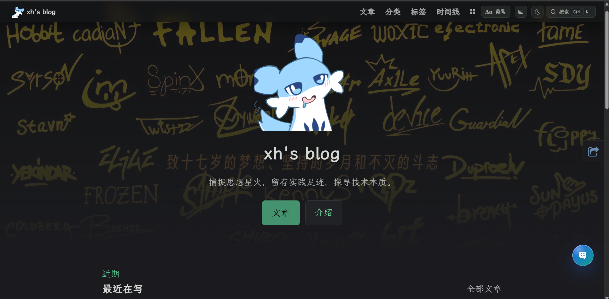
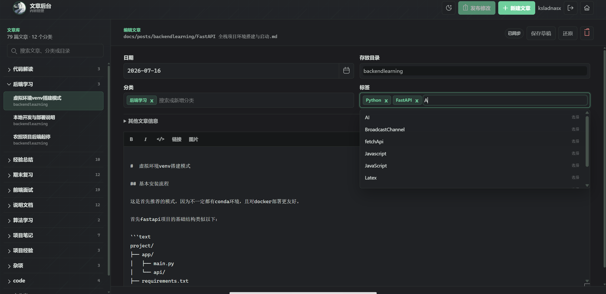

# xiaohan Blog

一个基于 VuePress 2 的个人博客项目，支持文章分类、标签、时间线、全文搜索、评论、主题切换，以及静态化的文章管理后台。

## 项目预览
### 博客前台展示



### 文章管理后台



## 主要功能

- VuePress 2 静态博客构建
- 文章分类、标签、时间线归档
- SlimSearch 站内搜索
- Markdown 扩展：KaTeX、Mermaid、图表、标记语法
- 明暗主题与阅读体验优化
- GitHub Actions 自动构建并发布到 `gh-pages`
- `/admin/` 静态文章后台
- 后台支持新建、编辑、删除、分类标签编辑、图片上传和统一发布
- 后台草稿保存在浏览器 IndexedDB，GitHub Token 保存在本机 localStorage

## 本地开发

安装依赖：

```bash
npm install
```

启动开发服务：

```bash
npm run docs
```

构建静态站点：

```bash
npm run docs:build
```

构建产物会生成到：

```txt
docs/.vuepress/dist
```

## 文章管理后台

后台入口：

```txt
/admin/
```

后台本身仍是静态页面，不需要额外服务器。它会在浏览器中调用 GitHub API，把文章和图片提交到仓库 `main` 分支。仓库收到提交后，GitHub Actions 会自动构建并发布网站。

后台支持：

- GitHub Token 本机记忆
- 文章按分类折叠浏览
- 新建与编辑 Markdown 文章
- 分类、标签、目录选择
- 图片上传到 `docs/.vuepress/public/uploads/`
- 未发布修改计数
- 统一发布到 GitHub
- 删除文章进入待发布队列

图片在文章中的推荐写法：

```html

```

`/uploads/...` 对应仓库中的：

```txt
docs/.vuepress/public/uploads/...
```

## 自动部署

`.github/workflows/deploy.yml` 会监听 `main` 分支的相关文件变化：

- `docs/**`
- `package.json`
- `package-lock.json`
- `deploy.sh`
- workflow 文件本身

触发后会执行：

```bash
npm ci
./deploy.sh
```

`deploy.sh` 会构建 VuePress，并把 `docs/.vuepress/dist` 发布到 `gh-pages` 分支。

## 目录结构

```txt
vuepress_blog/
├─ docs/
│  ├─ posts/                    # 博客文章
│  ├─ .vuepress/
│  │  ├─ config.js              # VuePress 配置
│  │  ├─ client.js              # 客户端增强
│  │  ├─ layouts/               # 自定义布局
│  │  ├─ styles/                # 全局样式
│  │  └─ public/
│  │     ├─ admin/              # 静态文章后台
│  │     └─ uploads/            # 图片等静态资源
├─ .github/workflows/deploy.yml # GitHub Actions 部署流程
├─ deploy.sh                    # 构建并发布到 gh-pages
├─ package.json
└─ README.md
```

## 常用命令

```bash
npm run docs
npm run docs:build
```

## 说明

这个项目的文章后台不会把文章保存到额外服务器。所有正式发布的内容最终都会变成 GitHub 仓库中的提交，因此仍然保留静态站点的部署方式，同时减少了日常写文章时手动执行部署脚本的步骤。
