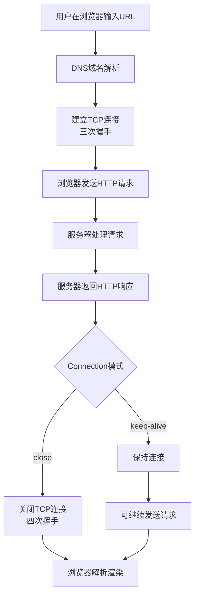

# Http协议详解
HTTP协议是万维网数据通信的基础，理解它以及浏览器与服务器如何交互，是掌握现代Web技术的关键。下面我将为你深入解析。

# 🌐 HTTP协议核心解析与浏览器-服务器交互全流程

## 1️⃣ HTTP协议的基本认识

HTTP（超文本传输协议）是一种详细规定了浏览器和万维网服务器之间互相通信规则的应用层协议。它基于TCP/IP通信协议来传递数据，如HTML文件、图片文件、查询结果等。

**关键特性**：

- **无连接**：早期HTTP协议每次连接只处理一个请求，服务器处理完请求并收到应答后即断开连接。HTTP/1.1支持持久连接（Keep-Alive），允许连接在一段时间内保持打开状态，以便继续发送其他请求。
- **无状态**：协议对于事务处理没有记忆能力，每个请求都是独立的。为了解决无状态带来的问题，HTTP/1.1引入了Cookie技术。
- **媒体独立**：只要客户端和服务器知道如何处理数据内容，任何类型的数据都可以通过HTTP发送，通过MIME-type指定内容类型。

## 2️⃣ HTTP报文结构剖析

### 请求报文格式

```
请求行（方法、URL、协议版本）
请求头（多个键值对）
空行
请求体（可选，如POST提交的数据）
```

示例请求行：`GET /index.html HTTP/1.1`

### 响应报文格式

```
状态行（协议版本、状态码、状态描述）
响应头（多个键值对）
空行
响应体（如HTML文档）
```

示例状态行：`HTTP/1.1 200 OK`

### 常用HTTP方法

| 方法   | 描述               | 特点                         |
| ------ | ------------------ | ---------------------------- |
| GET    | 请求指定资源       | 参数通过URL传递，有长度限制  |
| POST   | 提交数据或上传资源 | 数据通过请求体传递，相对安全 |
| PUT    | 更新完整资源       | 幂等操作                     |
| DELETE | 删除指定资源       |                              |
| PATCH  | 部分更新资源       |                              |
| HEAD   | 只获取响应头       |                              |

### 常见HTTP状态码

- **1xx**：信息性状态码，表示请求已被接收，继续处理
- **2xx**：成功状态码，如200 OK（请求成功）
- **3xx**：重定向状态码，如302 Found（临时重定向）
- **4xx**：客户端错误状态码，如404 Not Found（请求资源不存在）
- **5xx**：服务器错误状态码，如500 Internal Server Error（服务器内部错误）

## 3️⃣ 浏览器与服务器交互流程详解

以下流程图展示了一个完整的HTTP请求过程：



具体来说，当你在浏览器地址栏输入URL并按下回车后，整个流程如下：

### （1）DNS域名解析

浏览器首先会检查自身缓存和操作系统缓存中是否有该域名对应的IP地址记录。如果没有，就会访问DNS服务器，进行递归或迭代查询，最终获取到目标Web服务器的IP地址。

### （2）建立TCP连接

浏览器根据解析出的IP地址和默认端口80（HTTPS为443），向服务器发起TCP连接请求。通过TCP三次握手建立可靠连接：

- 第一次握手：客户端发送SYN包到服务器，进入SYN_SEND状态。
- 第二次握手：服务器收到SYN包，确认客户端的SYN，并发送SYN+ACK包。
- 第三次握手：客户端收到SYN+ACK包，向服务器发送确认包ACK，完成连接建立。

### （3）发送HTTP请求

建立TCP连接后，浏览器会向服务器发送HTTP请求报文。一个请求报文由请求行、请求头、空行和请求数据四部分组成。如果是POST请求，还会包含请求体数据。

### （4）服务器处理请求

Web服务器接收到请求后，会解析请求报文，定位请求资源。根据请求方法和其他信息，可能会访问后端服务（如PHP服务器）或数据库，进行相应的业务处理。

### （5）返回HTTP响应

服务器处理完请求后，会生成HTTP响应报文，包括状态行、响应头、空行和响应数据，通过TCP连接发送给浏览器。

### （6）连接管理

- 如果HTTP头信息中Connection模式为close，服务器在发送响应后会主动关闭TCP连接。
- 如果为keepalive，则该连接会保持一段时间，在此期间可以继续接收其他请求，减少建立新连接的开销。

### （7）浏览器解析和渲染

浏览器收到响应后，会解析HTML内容，构建DOM树和CSSOM树，组合后渲染页面。如果发现需要加载其他资源（如图片、CSS、JavaScript文件），会再次发起异步请求。

## 4️⃣ HTTP协议版本演进

- **HTTP/1.0**：最早的版本，每个请求需要单独的TCP连接，效率较低。
- **HTTP/1.1**：引入了持久连接（Keep-Alive），支持管线化（pipeline）和分块传输编码。
- **HTTP/2**：引入多路复用、头部压缩和服务端推送等特性，大幅提升性能。
- **HTTP/3**：基于QUIC协议（UDP），实现更快的连接建立和更低的延迟。

## 5️⃣ HTTP与HTTPS的区别

HTTPS在HTTP基础上加入SSL/TLS加密层，主要区别包括：

- HTTP是明文传输，HTTPS是加密传输
- HTTP默认端口80，HTTPS默认端口443
- HTTPS需要数字证书验证服务器身份
- HTTPS能防止数据窃取和篡改，更安全

## 6️⃣ 性能优化实践

基于HTTP协议的特点，常见的Web性能优化措施包括：

- 使用缓存（Cache-Control、ETag）
- 减少请求次数（合并资源文件）
- 启用HTTP/2或HTTP/3
- 使用CDN加速
- 压缩数据（Gzip、Brotli）

## 💎 总结

HTTP协议作为Web技术的基石，通过请求-响应模型实现了浏览器与服务器之间的高效通信。理解其工作原理、报文结构和交互流程，对于Web开发、性能优化和网络安全都至关重要。随着HTTP/2和HTTP/3的普及，HTTP协议继续演进，为更快、更安全的Web体验提供技术支持。

希望这份详细的解析能帮助你全面理解HTTP协议及浏览器与服务器的交互过程。如果你对某个特定方面有更深入的兴趣，我可以进一步展开说明。