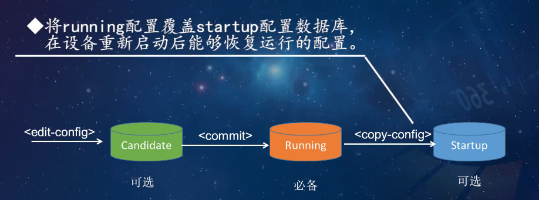

# SDN 期末复习

## 一、SDN 基础概念（必考核心）

### 1. SDN 定义（狭义 + 广义，常考对比）

-  两者核心区别（表格必考）：

  | 对比维度     | 狭义 SDN                      | 广义 SDN                            |
  | ------------ | ----------------------------- | ----------------------------------- |
  | 网络架构     | 仅 ONF 基于 OpenFlow 三层架构 | ONF、IETF I2RS、Overlay 架构        |
  | 南向接口协议 | 仅 OpenFlow                   | OpenFlow、NETCONF、OVSDB、OpFlex 等 |
  | 应用场景     | 软件定义数据中心              | 广域网、安全、接入、存储等多场景    |


### 2. 核心设计思想（三大核心，必背）

#### （1）解耦（Decoupling）

- 定义：将网络设备的**控制平面**（负责控制决策，如路由计算、策略制定）与**数据平面**（负责数据转发，如数据包接收、转发执行）物理分离。
- 传统网络问题：控制与数据平面紧耦合，设备功能固化，升级维护复杂。
- SDN 优势：两个平面独立演进，利于技术创新；实现逻辑集中控制，全局优化网络。
- 面临挑战：控制平面易成性能瓶颈；多控制器状态一致性难保证；控制与数据平面响应延迟影响可用性。

#### （2）抽象（Abstraction）

- 定义：屏蔽底层网络硬件细节，向上层提供统一的网络视图和接口，降低应用开发复杂度。
- 三种核心抽象：
  - 转发抽象：将传统二层 MAC 表、三层路由表抽象为**统一流表**，转发行为与硬件无关。
  - 分布状态抽象：控制器收集全网设备 / 链路状态，生成**全局网络视图**，屏蔽分布式控制细节。
  - 配置抽象：基于控制器提供的全局视图编程，替代传统逐设备命令行配置，支持 Python/Java 等脚本开发。
- 典型应用：Overlay 网络架构，应用无需关注 Underlay 物理网络细节，仅使用虚拟逻辑接口。

#### （3）可编程（Programable）

- 定义：通过开放接口（北向、南向、东西向）实现全网级可编程，支持动态调整网络策略。
- 传统网络局限：仅支持初级编程（Shell 脚本、网管协议），无法基于全网状态动态配置。
- SDN 可编程能力：
  - 接口层面：北向接口（REST API）、南向接口（OpenFlow）、东西向接口（NETCONF）均支持编程。
  - 数据平面：支持 DPDK 框架、P4 编程语言，实现转发逻辑自定义。
- 制约因素：硬件设备支持不足（如 OpenFlow v1.3 多级流表难完全实现）；厂商交换芯片差异导致功能实现复杂度高。

### 3. 重要属性（高频考点）

- 数据控制分离：实现逻辑集中式控制，区别于传统分布式控制。
- 网络可编程性：支持通过软件定义转发功能，满足个性化业务需求。

## 二、SDN 体系架构（分层 + 平面 + 接口，必考）

### 1. ONF 三层架构（核心架构，需掌握每层功能 + 交互）

#### （1）应用层

- 组成：网络业务系统（如视频点播、云计算服务）、SDN 应用（如防火墙、负载均衡应用）。
- 功能：通过调用控制层提供的 API，实现具体网络应用功能（如流量调度、安全策略执行）。
- 特性：支持多类型北向接口驱动，可封装高级北向代理接口，降低上层应用开发难度。

#### （2）控制层（SDN 控制器）

- 定位：网络 “大脑”，承上启下。
- 核心功能：
  - 北向：为应用层提供编程接口（如 REST API），开放网络资源抽象。
  - 南向：通过 **CDPI** 接口（如 OpenFlow）统一配置、管理基础设施层设备，下发流表和控制策略。
- 部署形式：逻辑集中，物理可分布式部署（多控制器集群协同）。

#### （3）基础设施层

- 组成：基于硬件 / 软件实现的网络设备（SDN 交换机、路由器），仅保留数据平面功能。
- 功能：
  - 接收控制器指令，执行数据包转发、处理（如流表匹配、数据包修改）。
  - 通过 CDPI 接口向控制器反馈网络配置、运行状态（如端口状态、流量统计）。

### 2. 四个平面（功能 + 职责，常考简答题）

#### （1）数据平面（转发面）

> 负责数据包或流的转发和处理，没有转发决策和控制

- 组成：若干网元（Network Element），每个网元包含**一个或多个** SDN 数据路径（Datapath）。
- 核心组件：SDN Datapath（逻辑网络设备），包含**数据平面接口、CDPI 代理、转发引擎、处理函数**。
- 关键技术：多级流表驱动的转发模型，通过 OpenFlow 接口接收控制器指令。

#### （2）控制平面

> 将应用层请求转换到数据平面，并为SDN应用提供底层的网络的抽象模型

- 组成：北向接口代理、SDN 控制逻辑、CDPI 驱动。
- 核心任务：
  - 将应用层请求转换为数据平面可执行的指令（如流表项）。
  - 为应用层提供底层网络抽象模型（如拓扑状态、链路负载）。
- 部署特性：逻辑上完整，可由多控制器实例协同组成集群。

#### （3）应用平面

> 通过北向接口与SDN控制器交互，通过封装API提供北向接口代理

- 组成：SDN 应用、应用逻辑、SLA 协议、NBI 驱动。
- 交互方式：通过北向接口（NBI）与控制平面通信，以可编程方式提交网络行为请求（如带宽申请、路径规划）。

#### （4）管理平面

> 负责网元的初始化配置，指定SDN Datapath控制器，定义SDN控制器及应用的控制范围等静态工作

- 核心职责：静态配置工作，包括网元初始化、指定控制器、定义控制器及应用的控制范围。
- 特性：不参与实时流量控制，仅负责网络基础配置。

### 3. 两大接口（南向 + 北向，必考对比 + 功能）

#### （1）南向接口（CDPI）

- 定义：控制平面与数据平面之间的接口。
- 核心功能：转发行为控制、设备性能查询、流量统计报告、事件通知（如端口状态变化）。
- 标准化协议：ONF 主推 OpenFlow 协议，不依赖厂商设备，实现跨厂商兼容。
- 关键技术：转发面开放协议（OpenFlow），支持控制器下发流表控制交换机转发。

#### （2）北向接口（NBI）

- 定义：应用平面与控制平面之间的接口。
- 核心功能：向应用层提供抽象网络视图，使应用能直接控制网络行为。
- 特性：开放、与厂商无关，未形成统一标准，主流实现为 REST API。
- 关键技术：REST API（Floodlight、Ryu 控制器均支持），支持交换机状态采集、流表推送等功能。

## 三、数据平面（流表 + 交换机 + 工具，实操 + 理论结合）

### 1. 核心组件与转发模型

#### （1）OpenFlow 交换机模型（必考架构 + 组件）

- 三大组成部分：

  **流表（Flow Table）**：流表是特定流的转发测流表项的集合，是OpenFlow交换机中对数据转发逻辑的抽象，也是其核心数据结构，由流表项组成，每个流表项包含匹配域、计数器、动作表。

  **安全通道**：交换机与控制器之间的通信通道，基于 TCP/TLS 加密，承载 OpenFlow 消息。

  **OpenFlow 协议**：南向接口标准，定义控制器与交换机的通信规范。

- OpenFlow 交换机模型版本演进（常考特性对比）：

  | 版本 | 发布时间 | 核心特性                                                |
  | ---- | -------- | ------------------------------------------------------- |
  | V1.0 | 2009.12  | 单流表；仅支持 IPv4                                     |
  | V1.1 | 2011.02  | **流水线处理**；组表；与 V1.0 不兼容                    |
  | V1.2 | 2011.12  | 多控制器支持；**IPv6 基本头**                           |
  | V1.3 | 2012.06  | **计量表**；IPv6 扩展头；匹配字段增至 40 个；长期稳定版 |
  | V1.4 | 2013.10  | **流表同步机制**；Bundle 消息                           |
  | V1.5 | 2014.12  | 出向流表；**入 / 出向匹配**                             |

#### （2）流表结构（V1.0 为例，必考细节）

- 包头域（12-Tuple）：涵盖 OSI 1-4 层特征，包括入端口、MAC 地址、IP 地址、TCP/UDP 端口等，多字段匹配,**支持精确匹配或 “ANY” 匹配**。
- 计数器：**统计流量信息**，包括流表项接收数据包数 / 字节数、流持续时间、端口错误数等。
- 动作表：**定义匹配后的处理行为**，包括：
  - 必备动作：转发（ALL/CONTROLLER/LOCAL 等端口）、丢弃（无明确动作时默认）。
  - 可选动作：修改包头字段（VLAN ID、MAC/IP 地址）、排队（QoS 支持）。

#### （3）数据包处理流程（必考步骤）

1. 交换机接收数据包，解析包头信息（入端口、MAC/IP 地址等）。
2. 按优先级匹配流表项，精准匹配项优先（如同时匹配 IP 和端口的流表项优先级高于仅匹配 IP 的项）。
3. 匹配成功：更新计数器，执行对应动作（转发 / 丢弃 / 修改）。
4. 匹配失败：通过安全通道将数据包封装为 Packet-in 消息发送给控制器。
5. 控制器下发流表项（Flow-mod 消息），交换机后续按新流表处理同类数据包。

### 2. 关键技术

#### （1）多级流表

- 作用：解决单流表臃肿问题，实现流水线处理，提升匹配效率。
- 架构：流表 0→流表 1→…→流表 n，数据包按顺序匹配，支持跳转逻辑。

#### （2）PISA 架构

- 定义：可编程协议无关交换机架构，支持用户自定义匹配字段、协议解析过程和转发逻辑。
- 核心组件：可编程解析器、入口 / 出口 “匹配 - 动作” 逻辑、缓冲、可编程包生成器。
- 优势：**实现协议无关转发**，改进 OpenFlow 交换机对新协议的支持不足问题。

#### （3）P4 语言

- **定位：数据平面编程语言，支持协议无关转发逻辑定义。**
- 核心组件：
  - 首部（Headers）：定义报文头部格式（如 IPv4 包头）和元数据（如入端口、出端口）。
  - 解析器（Parsers）：基于有限状态机，定义数据包解析流程（如以太网帧→IPv4 包解析）。
  - 表（Tables）：定义匹配域、动作及匹配方式（精确匹配 / 最长前缀匹配）。
  - 动作（Action）：定义转发逻辑（如修改 TTL、转发端口指定）。
- 程序模板：包含 Parser、Ingress 处理、Egress 处理、Deparser 等模块，支持流水线转发。

### 3. SDN 交换机分类（常考类型 + 代表产品）

#### （1）物理交换机

- 混合模式交换机：支持传统二 / 三层处理与 SDN 模式（如 OpenFlow），代表产品：Cisco Nexus 9000、Juniper EX9200。
- 白盒交换机：无品牌标识，支持 OpenFlow，代表产品：盛科 V330、Pica8 P3290。
- 基于 FPGA 的交换机：用于科研验证，如 NetFPGA。

#### （2）虚拟交换机

- 核心优势：成本低、配置灵活，支持中小规模网络，代表产品：Open vSwitch（OVS）、Cisco Nexus 1000V。
- OVS 关键特性：支持 OpenFlow/OVSDB 协议；支持 VLAN、隧道（VXLAN/GRE）；支持流量监控（NetFlow/sFlow）。

### 4. 核心工具与操作（实操必考）

#### （1）Mininet

定义：基于 Linux Container 的网络仿真工具，支持创建虚拟网络（主机、交换机、控制器）。

核心功能：

- 拓扑支持：最小化、单一、线性、树形及自定义拓扑（Python 脚本）。

- 常用命令：

  拓扑构建：`sudo mn --topo=tree,depth=2,fanout=2`（树形拓扑）。

  连通性测试：`pingall`（所有主机互 ping）。

  流表操作：`dpctl add-flow in_port=1,actions=output:2`（添加流表）。

  性能测试：`iperf h1 h2`（测试主机带宽）。

安装与验证：通过源码（`git clone https://github.com/mininet/mininet.git`）或虚拟机安装，`sudo mn --test pingall`验证安装成功。

#### （2）OVS 操作（命令必考）

- 网桥管理：
  - 创建网桥：`ovs-vsctl add-br br0`。
  - 删除网桥：`ovs-vsctl del-br br0`。
- 端口管理：
  - 添加端口：`ovs-vsctl add-port br0 eth0`。
  - 查看端口：`ovs-vsctl list-ports br0`。
- 流表操作：
  - 添加流表：`ovs-ofctl add-flow br0 in_port=1,actions=output:2`。
  - 查看流表：`ovs-ofctl dump-flows br0`。
  - 删除流表：`ovs-ofctl del-flows br0 in_port=1`。
- 控制器连接：`ovs-vsctl set-controller br0 tcp:127.0.0.1:6633`。

## 四、南向接口协议（OpenFlow 为核心，必考）

### 1. 南向接口协议概述

- 定义：控制平面与数据平面之间的通信协议，实现控制指令下发和设备状态上报。
- 主流协议：OpenFlow、OF-Config、NETCONF、OVSDB、XMPP 等。
- SDN南向接口（SDN南向网络控制）的核心作用是实现控制器与网络设备（交换机、路由器等）的通信，核心需求是**标准化、可扩展、支持集中控制**，主流南向控制协议以开源标准协议为主能（如后续提及的三个协议）。
- 南向网络控制功能：
  1. 链路发现：控制器利用南向接口的上行通道收集底层交换设备上报的链路状态信息，并统计和分析对底层链路的发现及状态信息
  2. 拓扑管理：拓扑管理为了随时监控和采集网络中 SDN 交换机的信息，及时反馈网络的设备工作状态和链路链接状态，以形成对网络拓扑及其变化的准确认识。
  3. 策略制定：策略制定是南向网络控制中的核心功能之一，交换流表生成算法是影响控制器智能化水平的关键因素，控制器通过策略制定生成相应的流表项，满足不同网络层次的传输需求。
  4. 表项下发：控制器通过表项下发将流表生成算法的结果告知底层交换机，指导具体转发行为。
- OpenFlow 是 SDN 的标志性南向协议，也是目前工业界和学术界最成熟的标准（由 ONF 组织维护）。
- NETCONF（网络配置协议）采用 “客户端 - 服务器” 模式（控制器为客户端，设备为服务器）。
- RESTCONF 是 NETCONF 的 “RESTful 版本”，基于 HTTP/HTTPS 协议，支持 JSON 或 XML 格式，兼容 REST 架构风格。它简化了 NETCONF 的交互逻辑。
- P4 是一种 “数据平面可编程语言”，而 P4Runtime 是其配套的南向运行时协议，用于控制器向设备下发 P4 定义的转发逻辑。

### 2. OpenFlow 协议（核心协议，细节必考）

#### （1）安全通道

- 建立过程：控制器监听 TCP 6633 端口，交换机启动后主动连接；双方交换证书认证，协商支持的最低协议版本；认证通过后建立加密通道（TLS）。
- 维护机制：通过 “保活”（Keep-alive）消息维持连接；连接异常时，交换机尝试连接备份控制器，失败则进入紧急模式（仅保留紧急流表项）。

#### （2）消息类型（三大类）（实现层面定义的事件类名称就是加个EventOFP前缀然后注意大小写就行）

| 消息类型             | 核心消息                                                  | 功能                                                         | 触发场景                                  |
| -------------------- | --------------------------------------------------------- | ------------------------------------------------------------ | ----------------------------------------- |
| Controller-to-Switch | Features（实现层面定义的事件类是EventOFPFeatures）        | 控制器获取交换机特性（流表数、端口信息）                     | 连接建立后控制器主动发起                  |
|                      | Flow-mod                                                  | 增 / 删 / 改交换机流表项                                     | 控制器主动下发或 Packet-in 后响应         |
|                      | Packet-out                                                | 控制器指导交换机转发数据包                                   | 收到 Packet-in 消息后，控制器返回转发指令 |
| Asynchronous（异步） | Packet-in（实现层面定义的事件类是EventOFPPacketIn）       | 用于交换机告知控制器新数据包的到达：如果新数据包在流表中没有匹配项或者匹配项指定端口为Controller的动作时才发送。（缓存足够，只发分组头控制信息和交换机缓存标识） | 数据包匹配失败或需控制器处理              |
|                      | Flow-removed（实现层面定义的事件类是EventOFPFlowRemoved） | 流表项因超时 / 修改被删除                                    | 流表项过期或被控制器删除                  |
|                      | Port-status                                               | 上报端口状态变化（Up/Down）                                  | 交换机端口物理状态改变                    |
| Symmetric            | Hello                                                     | 协议版本协商                                                 | 连接建立初期双向发送                      |
|                      | Echo                                                      | 保活检测                                                     | 连接维护期间定期发送                      |

#### （3）通信流程（必考步骤）

1. 交换机与控制器建立 TCP 连接，交换 Hello 消息协商协议版本。
2. 控制器发送 Features-request 消息，获取交换机特性（流表数、端口）。
3. 控制器用Get-config 获取交换机全局参数信息，下发 Set-config 消息配置交换机全局参数（并非配置转发规则）（可选）。
4. 正常通信：交换机上报 Packet-in/Port-status 消息，控制器下发 Flow-mod/Packet-out 消息。
5. 连接维护：通过 Echo 消息保活，异常时触发重连。


### 3. 其他南向协议（常考功能对比）

#### （1）OF-Config

- 定位：OpenFlow 的 “伴侣协议”，基于 NETCONF 传输，负责交换机配置管理。实现OpenFlow 交换机的配置点的远端配置
- 核心功能：控制器 IP 配置、多控制器连接、端口 / 队列配置、加密认证。
- 版本：1.0版本对应OpenFlow的1.2版本，而1.1和1.2都对应OpenFlow的1.3版本（满足版本对应的管理和配置需求）

#### （2）NETCONF

- 架构：客户端 - 服务器模式，基于 SSH/TLS 传输，支持配置数据增删改查。
- NETCONF的三个配置数据库：
  - running：当前运行的生效配置，一般提供持久化操作的指令。
  - candidate：候选配置（修改不影响运行中的网络），可用于反复配置测试。
  - startup：设备重启后加载的配置。
- 核心操作：`<get-config>`（获取配置）、`<edit-config>`（修改配置）、`<copy-config>`（复制配置）。


- 三个配置数据库间的逻辑：你可以通过`<get-config>`在condidate数据库上进行配置，配置确认后利用`<commit>`功能提交到running数据库，最后还可以将Running数据库中的配置利用`<copy-config>`复制配置到startup数据库以便重启后加载配置。



#### （3）OVSDB

- 定位：OVS 交换机的数据库管理协议，基于 JSON-RPC。
- 核心功能：管理 OVS 的网桥、端口、流表等配置，支持增删改查操作。

## 五、控制平面（控制器 + 编程，理论 + 实操）

### 1. SDN 控制器核心功能

#### （1）南向网络控制（必考）

- 链路发现：通过 LLDP 协议收集全网链路信息，生成拓扑视图。
- 拓扑管理：维护网络拓扑结构，实时更新设备 / 链路状态。
- 策略制定：基于应用需求和网络状态，生成转发策略（如流表规则）。
- 表项下发：支持主动下发（提前配置流表）和被动下发（收到 Packet-in 后下发）。

**LLDP**(Link Layer Discovery Protocol(链路 层 发现 协议))：LLDP是一个二层的协议，提供了一种标准的链路发现方式 ，广泛用于网络设备的发现，包括SDN网络； 

 LLDP可以将SDN控制器的主要能力、管理地址、设备标识等信息组成不同的TLV，并封装在LLDPDU中，发布给直连的 Openflow邻居交换机。在 LLDP报文中，以太网类型为0x88cc。

**LLDP链路发现过程：**

① 控制器给与之相连的所有交换机发送带LLDP的Packet-out数据包，并要求交换机向除控制器端口之外的所有端口 发送LLDP数据包； 

② 交换机收到Packet-out消息之后执行控制器指令； 

③ 交换机因此会收到来自邻居交换机的LLDP数据包，当邻居交换机不在自己的流表中时，则发送Packet-in消息给控制器，由此创建交换机之间两两连接的记录。


#### （2）北向业务支撑

- 提供网络资源抽象（如拓扑、带宽）和可编程接口（REST API），支持上层应用开发。

### 2. 开源控制器对比（常考特性 + 编程语言）

| 控制器       | 编程语言   | 核心特性                        | 适用场景                 |
| ------------ | ---------- | ------------------------------- | ------------------------ |
| NOX          | C++/Python | 首个开源控制器，模块化设计      | 早期科研、基础 SDN 测试  |
| POX          | Python     | 简单易上手，开发效率高          | 快速原型开发、教学实验   |
| Ryu          | Python     | 组件化框架，支持 OpenStack 集成 | 企业级应用、多场景适配   |
| Floodlight   | Java       | 企业级稳定性，丰富 REST API     | 生产环境、大规模网络     |
| OpenDayLight | Java       | 厂商驱动，功能全面              | 运营商网络、复杂业务场景 |

### 3. 控制器编程（实操必考）

#### （1）POX 编程

- 启动命令：`./pox.py openflow.of_01 forwarding.l2_learning`（加载 OpenFlow 1.0 模块和二层自学习模块）。
- 核心流程：
  1. 组件注册：通过`core.registerNew()`注册自定义组件。
  2. 事件监听：通过`core.listen_to_dependencies()`监听内核事件（如 Packet-in）。
  3. 事件处理：定义`_handle_PacketIn`函数，处理数据包匹配、流表下发逻辑。
- 二层自学习交换机核心逻辑：
  - 学习阶段：从 Packet-in 消息中提取源 MAC 地址和入端口，更新 MAC 地址转发表。
  - 转发阶段：查询目标 MAC 地址对应的端口，存在则下发流表转发，不存在则泛洪。
  - 数据包处理流程：

#### （2）Ryu 编程

- 启动命令：`ryu-manager simple_switch.py ofctl_rest.py`（加载简单交换机模块和 REST API 模块）。
- 核心流程：
  1. **Ryu组件继承 于RyuApp 类**：自定义应用需继承`ryu.base.app_manager.RyuApp`。
  2. 事件绑定：通过`@set_ev_cls`修饰器绑定事件（如`EventOFPPacketIn`）。
  3. 事件处理：
     - 解析消息：`ev.msg`获取 Packet-in 消息，`dp = msg.datapath`获取交换机对象。
     - 定义动作：`actions = [ofp_parser.OFPActionOutput(ofp.OFPP_FLOOD)]`（泛洪动作）。
     - 发送消息：`dp.send_msg(out)`下发 Packet-out 或 Flow-mod 消息。
- 常用 API：获取交换机状态（`GET /stats/switches`）、下发流表（`POST /stats/flowentry/add`）。
- 二层自学习机涉及的消息：Packet-in 消息，Packet-out消息，Feature消息，还可能涉及Flow-mod消息。
- 二层自学习机需要对EventOFPFeatures类型事件和EventOFPPacketIn类型事件进行监听。
- **Ryu 编程实现层面** 定义的 OpenFlow 事件类通常继承自控制器的 `OFPEvent` 基类，与协议消息强绑定，以 `ofp_event.EventOFPxxx` 命名
- 在 **RYU 控制器**中，**交换机连接的状态调度器（dispatcher）**，代表控制器与交换机通信的不同阶段。每个阶段对应特定的 OpenFlow 消息交互，且只有处于对应阶段时，才能处理该阶段的事件。以下是 RYU 核心 dispatcher 通信阶段、对应功能及可处理的事件类型：

  | 通信阶段（dispatcher 名称xxx_DISPATCHER） |                      阶段核心作用                       |                    可处理的 RYU 事件类型                     |
  | :---------------------------------------: | :-----------------------------------------------------: | :----------------------------------------------------------: |
  |         **HANDSHAKE_DISPATCHER**          | 控制器与交换机建立 TCP 连接，进行 OpenFlow 协议版本协商 | `ofp_event.EventOFPHello` `ofp_event.EventOFPErrorMsg`（握手失败时） |
  |           **CONFIG_DISPATCHER**           |    完成握手后，控制器查询交换机特性，进行初始化配置     | `ofp_event.EventOFPFeaturesRequest` `ofp_event.EventOFPFeaturesReply` `ofp_event.EventOFPErrorMsg`（配置失败时） |
  |            **MAIN_DISPATCHER**            |     正常数据转发与设备管理的核心阶段，连接稳定运行      | `ofp_event.EventOFPPacketIn` `ofp_event.EventOFPFlowRemoved` `ofp_event.EventOFPPortStatus` `ofp_event.EventOFPEchoRequest` `ofp_event.EventOFPEchoReply` `ofp_event.EventOFPFlowMod`（响应事件） |
  |            **DEAD_DISPATCHER**            |           控制器与交换机的连接断开或异常终止            | 连接断开相关的清理事件（无特定 OpenFlow 协议事件，用于执行资源释放逻辑） |

  **关键说明**：

  - dispatcher 阶段是**递进切换**的：`HANDSHAKE_DISPATCHER` → `CONFIG_DISPATCHER` → `MAIN_DISPATCHER`，异常时进入 `DEAD_DISPATCHER`。
  - 在 RYU 应用编程中，需**通过 `set_ev_cls(ofp_event.EventOFPPacket)` 装饰器指定事件对应的 dispatcher 阶段，**才能正确触发事件处理函数。
    - 例如代码中的 @set_ev_cls(ofp_event.EventOFPPacket， MAIN_DISPATCHER)意思是指定是ofp_event.EventOFPPacket事件消息类型，事件阶段是MAIN_DISPATCHER。
      - handler是对应的消息处理函数，函数中msg.datapath获取消息发自与哪个datapath（交换机的流表的datapath）
      - dp.ofproto_parser获取openflow协议编码器，再利用此构造of消息

## 六、北向接口（REST API+RESTCONF，必考）

### 1. 北向接口概述

- 定义：应用平面与控制平面之间的接口，提供网络资源抽象和可编程能力。

- 北向接口功能：为上层业务应用提供网络资源与基础功能的抽象，为上层应用和网络管控提供可编程的开发接口。

- **基于意图的API**：基于自上而下的网络视角和方法，重点在于满足上层应用和业务实现逻辑和服务质量的需求，关注“应用需要什么”。

- **功能型北向API**：基于自下而上的网络视角和方法，重点在于网络资源的抽象与控制能力的开放，关注“网络提供什么”。

- 标准化现状：未形成统一标准，ONF、IRTF、IETF 等组织推进标准化工作。

- 北向接口分类（常考对比）：

  

  | 类型           | 核心特点                   | 关注重点     | 示例                           |
  | -------------- | -------------------------- | ------------ | ------------------------------ |
  | 功能型 NBI     | 自下而上，聚焦网络能力开放 | 网络能做什么 | Topology、L2VPN、L3VPN 接口    |
  | 基于意图的 NBI | 自上而下，与技术无关       | 应用需要什么 | 企业分支带宽保障、访问控制需求 |

### 2. REST API（主流实现，细节必考）

#### （1）核心概念

- REST：表述化状态转移，一组架构约束（客户 - 服务器、无状态、缓存、统一接口等）。
- RESTful：遵循 REST 约束的架构风格；REST API：符合 RESTful 规范的 API。
- 核心要素：
  - 资源：网络设备、流表、拓扑等，通过 URI 标识。
  - HTTP 动词：GET（查询）、POST（创建）、PUT（更新）、DELETE（删除）。
  - 状态码：2xx（成功）、4xx（客户端错误）、5xx（服务器错误）。

#### （2）设计规范

- URI 命名：
  - 文档型资源用单数（如`/user/123`）。
  - 集合型资源用复数（如`/users`）。
  - 控制器型资源用动词（如`/login`）。
- 格式要求：
  - 分隔符 “/” 用于层级划分，不允许结尾出现。
  - 优先使用连字符 “-” 代替下划线 “_”。
  - 不包含文件扩展名（如`.json`）。
- 示例：删除 ID 为 123 的用户，URI 为`DELETE /users/123`（而非`/deleteUser?id=123`）。

#### （3）实操工具与命令

- curl 命令（必考）：
  - 获取交换机状态：`curl http://<controller_ip>:8080/wm/core/switch/all/desc/json`。
  
  - 创建 ACL 规则：`curl -X POST -H "Content-Type: application/json" -d '{"src-ip":"10.0.0.1/32","dst-ip":"10.0.0.2/32","action":"deny"}' http://<controller_ip>:8080/wm/acl/rules/json`。
  
  - curl命令创建流表（这里指定数据类型是json）：
  
    ```curl
    curl -X Post -d '{
    	"dpid":2,		
    	"priority":100,  //优先级
    	"match":{  //匹配选项
    		"in_port":80
    	},
    	"actions":[  //匹配后执行的动作（对象数组）
    		{
    			"type":"OUTPUT",  //转发动作，端口为2
    			"port":2
    		}
    	]
    }' http://localhost:8080/stats/flowentry/add   //最后是动作执行的url
    ```
  
    收到这种消息后交换机会发送Flow-mod消息（负责流表的增删改）对交换机的流表进行增操作
  
- Postman：可视化工具，支持 GET/POST/PUT/DELETE 请求，支持 JSON/XML 格式。

### 3. RESTCONF 协议

- 定义：基于 REST 模式的**网络配置协议**，使用 YANG 建模，**NETCONF** 定义数据存储。
- 核心特性：
  - 传输协议：HTTP/HTTPS。
  - 数据格式：JSON/XML。
  - 资源类型：API 资源、数据存储资源、数据资源等，对应不同媒体类型（如`application/vnd.yang.data`）。
- 核心操作（与 NETCONF 映射）：
  - GET：对应`<get-config>`。
  - POST：对应`<edit-config>（create）`。
  - PUT：对应`<edit-config>（replace）`。
  - DELETE：对应`<edit-config>（delete）`。
- 示例：获取 JSON 格式的路由配置（使用参数替代Accept头Accept:application/vnd.yang.data+json）：

  ```
  GET /.well-known/restconf/datastore/example-routing:routing?format=json HTTP/1.1
  Host:example.com
  ```

  

## 七、期末高频考点与题型预测

### 1. 简答题（必考方向）

- SDN 定义与核心设计思想。
- ONF 三层架构与四大平面功能。
- OpenFlow 协议消息类型与通信流程。
- 南向 / 北向接口协议对比。
- 开源控制器（POX/Ryu）编程核心流程。

### 2. 实操题（必考方向）

- Mininet 拓扑构建与连通性测试（`pingall`/`iperf`）。
- OVS 流表增删改查操作（`ovs-ofctl`命令）。
- REST API 调用（curl/Postman 下发流表、查询状态）。
- POX/Ryu 控制器简单应用开发（二层自学习交换机）。

### 3. 综合分析题（必考方向）

- 结合流表匹配过程分析数据包转发逻辑。
- 基于 SDN 架构设计小型企业网络（含控制器、交换机、应用部署）。
- 分析 SDN 与传统网络在流量控制、配置管理上的差异。

## 八、 知识点

### 一、SDN 基础架构

1. SDN 三层框架
   - 组成：应用层、控制层、基础设施层
   - 各层作用：
     - 应用层：承载多元业务，通过调用控制层 API 实现弹性应用
     - 控制层："大脑"，承上启下，提供编程接口 + 统一管控基础设施层设备
     - 基础设施层：由网络设备组成，负责数据包转发与处理
2. SDN 四个平面
   - 组成：数据平面、控制平面、应用平面、管理平面
   - 各平面功能：
     - 数据平面：逻辑网络设备，负责数据包 / 流的转发和处理
     - 控制平面：控制器与设备的通信层面，实现管控逻辑
     - 应用平面：承载上层网络应用
     - 管理平面：网元初始化配置、指定控制器、定义控制范围等静态工作

### 二、OpenFlow 核心组件与概念

1. 流表相关
   - 流表定义：OpenFlow 交换机中转发策略表项的集合，核心数据结构，含优先级顺序的流表项，集成交换机、路由器、防火墙等功能
   - 与传统交换机转发表的区别：
     - 传统转发表：仅含 MAC 地址与端口映射
     - OpenFlow 流表：涵盖 OSI 2-4 层网络特征，以 "匹配 - 动作" 模式处理数据转发
2. OpenFlow 交换机模型三组件
   - 流表：含流表项，指示交换机流处理方式
   - 安全通道：连接交换机与远端控制器，负责交互通信
   - OpenFlow 协议：定义南向接口标准，提供开放通信规范
3. OpenFlow 消息类型
   
   三种类型

### 三、SDN 关键流程

1. 网络链路发现过程
   - 控制器向相连交换机发送带 LLDP 的 Packet-out 消息
   - 交换机执行广播 LLDP 操作
   - 交换机接收其他交换机的 LLDP 消息后，向控制器发送 Packet-in 消息
   - 控制器基于接收的信息创建交换机两两连接关系
2. 控制器与交换机通信流程
   - 安全通道作用：传输 OpenFlow 控制协议消息
   - 协议版本协商：在 Hello 消息中完成
   - 必选操作对应的消息：Hello、Features-request、Features-reply、Set Config、Get Config Request、Get Config Reply（根据示意图关联）
   - 通信环节：协商环节、配置环节、正常通信环节
   - pingall 时 5 号箭头消息：Packet-in、Flow-mod

### 四、南向 / 北向接口

1. 南向网络控制功能（核心 3 个）
   - 表项下发：向交换机下发流表等表项，指导转发行为
   - 链路发现：通过 LLDP 等协议探测网络链路连接状态
   - 设备状态监控：实时获取交换机端口、流表等状态信息
2. 北向接口功能
   - 为上层业务提供网络资源与基础功能抽象
   - 为上层应用和网络管控提供可编程开发接口
3. 北向 API 类型区别
   - 基于意图的北向 API：自上而下视角，关注 "应用需要什么"，满足业务逻辑与服务质量需求
   - 功能型北向 API：自下而上视角，关注 "网络能提供什么"，侧重网络资源抽象与控制能力开放

### 五、控制器编程（Ryu/POX）

1. 二层自学习交换机相关
   - 涉及 OpenFlow 消息：Features 消息、Packet-in、Packet-out、Flow-mod 消息
   - Ryu 控制器事件监听：
     - 事件类型：EventOFPFeatures、EventOFPPacketIn
     - 通信阶段：CONFIG_DISPATCHER、MAIN_DISPATCHER
   - 数据包处理流程（Ryu）：获取 Packet-in 消息对象→确定消息来源 datapath→获取协议编解码器→定义 Packet-out 动作→构造 Packet-out 消息→发送给交换机
2. Ryu 组件编程基础
   - 继承类：RyuApp 类，提供应用开发基本模板，完成基础操作
   - set_ev_cls 修饰器：绑定事件与处理函数，参数含事件消息类型、接收阶段、处理函数名

### 六、NETCONF/RESTCONF 协议操作

1. NETCONF 相关
   - 三种数据库及关系：
     - running 数据库：当前运行的生效配置，含设备所有概念状态信息
     - candidate 数据库：存放候选配置，修改不直接影响设备，可通过 commit 生效到 running
     - startup 数据库：保存运行配置，设备重启后恢复配置；可通过 copy-config 由 running 覆盖
   - 操作映射：
   
     ```printtxt
     RESTCONF 的 GET→<get-config>、PUT→<edit-config>(replace)、POST→<edit-config>(create)、DELETE→<edit-config>(delete)
     ```
   
2. RESTCONF 消息解析
   - 核心要素提取：方法（如 GET）、入口（/.well-known/restconf/）、资源（如 datastore/example-routing:routing）、HTTP 头（Host、Accept）
   - 资源类型与数据格式：数据存储资源，支持 json 格式
   - 数据格式约束：可通过查询参数（?format=json）替代 Accept 头约束

### 七、实操配置与命令

1. 流表操作命令
   - 查看流表：dostl dump-flows
   - 删除流表：dpctl del-flows
   - 添加流表：dpctl add-flow in_port=$1,actions=output:2（示例）
2. curl 调用 REST API 创建流表（Ryu 控制器）
   - 格式：curl -X POST -d '{"dpid": 目标 ID, "match": {"priority": 优先级，"in_port": 入端口}, "actions": [{"type": "OUTPUT", "port": 出端口}]}' 接口 URL
   - 示例：curl -X POST -d '{"dpid":2,"match":{"priority":100,"in_port":1},"actions":[{"type":"OUTPUT","port":3}]}' http://localhost:8080/stats/flowentry/add
3. 网络连通性测试
   - 命令：pingall（全局连通性）、ping 目标节点（两两连通性）
   - 流表对 ping 的影响：流表增删改会改变数据包匹配 - 动作逻辑，影响连通性

### 八、配置协议操作示例解析

1. NETCONF 操作示例
   - 操作类型：`<get-config>`，配置数据库对象：`<running/>`
   - 过滤条件：通过 xpath 选择 /capable-switch 节点

2. RESTCONF 消息格式获取数据存储资源中的json类型数据：

   - HTTP头方式：

     ```printtext
     GET /.well-known/restconf/datastore HTTP/1.1
     Host: example.com
     Accept: application/vnd.yang.data+json
     ```

   - 格式替换：通过查询参数指定格式，替换后消息含`?format=json`。对应查询字段方式：

     GET /.well-known/restconf/datastore?format=json   HTTP/1.1

     Host: example.com

