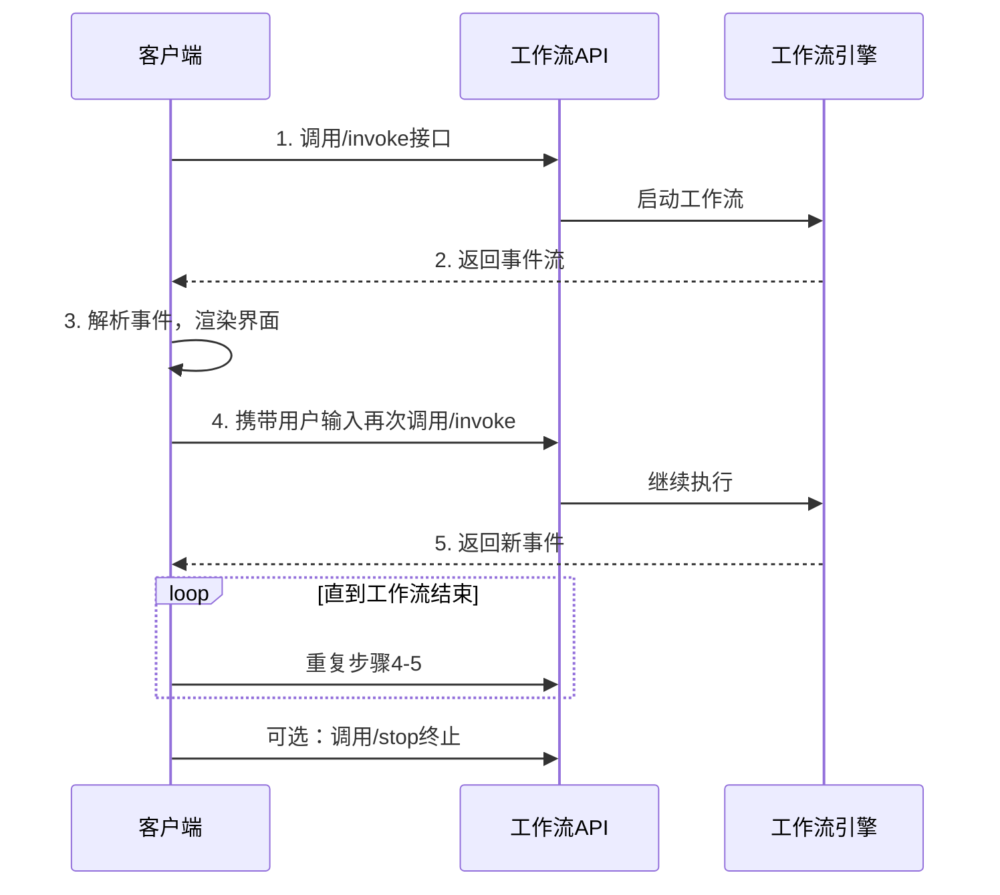

# 工作流 API 调用方式文档

**请注意，此仅为工作流调用的示例说明文档，仅为示例数据。**

## 一、接口基本信息
workflow_id：5f1d719f2de94546bb04983da63b17e3
### 1. 工作流请求执行接口
- **接口地址**：`POST /api/v2/workflow/invoke`
- **说明**：发起工作流执行，让工作流从开始节点运行

### 2. 工作流停止运行接口
- **接口地址**：`POST /api/v2/workflow/stop`
- **说明**：手动终止正在运行的工作流

---

## 二、整体调用流程



### 详细步骤说明

#### 第一步：发起工作流执行
调用 `/invoke` 接口启动工作流：

```python
import requests
import json

url = "${location.origin}/api/v2/workflow/invoke"

payload = json.dumps({
   "workflow_id": "${workflow_id}",
   "stream": False,  # 为空或者不传，都会请求流式返回工作流事件。本示例为了直观展示返回结果，所以改为非流式请求，真实场景下为了用户体验建议请求流式。
})

headers = {
   'Content-Type': 'application/json'
}

response = requests.request("POST", url, headers=headers, data=payload)
print(response.text)  # 输出工作流的响应
```

#### 第二步：获取并解析返回的事件
```json
{
    "status_code": 200,
    "status_message": "SUCCESS",
    "data": {
        "session_id": "d4347ab8e8cd48c48ac9920dbb5a9b35_async_task_id",
        "events": [
            {
                "event": "guide_word",
                "message_id": null,
                "status": "end",
                "node_id": "start_553b9",
                "node_execution_id": "ce9a73b376c647159b1b2de1806129cf",
                "output_schema": {
                    "message": "您好，请问想聊些什么呢？",
                    "reasoning_content": null,
                    "output_key": null,
                    "files": null,
                    "source_url": null,
                    "extra": null
                },
                "input_schema": null
            }
        ]
    }
}
```

**重要**：必须保留 `session_id` 等上下文信息，以便后续继续请求。

#### 第三步：根据事件类型渲染前端
- **普通输出**（如 `event="output_msg"`）：直接展示内容
- **等待用户交互输入**（如 `event="input"`、`event="output_with_input_msg"`、`event="output_with_choose_msg"`）：渲染对应的界面（对话框、表单等）

#### 第四步：携带用户输入再次调用接口
```python
payload = json.dumps({
    "workflow_id": "7481368b-dd1c-43ef-a254-dce219ee53e8",
    "stream": False,
    "input": {
        "input_2775b": {  # 事件里的节点ID
            "user_input": "贵州茅台股价情况"
        }
    },
    "message_id": "387216",
    "session_id": "1fc60fe0edb44219bbef5f8870dd4639_async_task_id"
})
```

#### 第五步：持续交互直至结束
- 继续获取并解析返回的事件
- 直到返回 `close` 事件（非必须）结束工作流运行
- 也可调用 `/workflow/stop` 接口手动终止工作流

---

## 三、返回事件类型与处理方式

### 事件通用数据结构

| 字段              | 类型   | 必填 | 描述                   |
| ----------------- | ------ | ---- | ---------------------- |
| event             | string | 是   | 事件名称               |
| node_id           | string | 是   | 触发事件的节点ID       |
| message_id        | string | 是   | 消息在数据库中的唯一ID |
| node_execution_id | string | 是   | 执行此节点时的唯一ID   |
| input_schema      | object | 是   | 需要用户输入的schema   |
| output_schema     | object | 是   | 输出schema             |

### input_schema 结构

```json
{
  "input_type": "form_input",  // 输入类型：form_input、dialogue_input、message_inline_input等
  "value": [  // 需要用户输入的字段信息
    {
      "key": "category",        // 字段的唯一key
      "type": "select",         // 字段类型：text、file、select
      "value": "",              // 字段的默认值
      "multiple": true,         // 是否支持多选
      "label": "请选择操作",     // 字段的展示名称
      "required": true,         // 是否必填
      "options": [              // 下拉框选项
        {
          "id": "0b8a2fe9",
          "text": "操作1"
        }
      ]
    }
  ]
}
```

### output_schema 结构

```json
{
  "message": "输出内容",                // 直接展示给用户的文本
  "reasoning_content": "思考过程",      // 推理模型的思考过程
  "output_key": "output",               // 输出内容对应的变量key
  "files": [                            // 文件列表
    {
      "path": "http://minio:9000/xxx.png",
      "name": "测试图片.png"
    }
  ],
  "source_url": "",                      // 溯源url
  "extra": "{\"qa\": \"本答案来源于已有问答库\"}"  // QA知识库溯源内容
}
```

---

## 四、各类事件详解

### 1. 开场白事件
**事件标识**：`event="guide_word"`

```json
{
  "event": "guide_word",
  "node_id": "start_xxx",
  "output_schema": {
    "message": "本工作流可以解决xxxx等问题"
  }
}
```
**处理逻辑**：将 `output_schema.message` 展示给用户即可。

### 2. 引导问题事件
**事件标识**：`event="guide_question"`

```json
{
  "event": "guide_question",
  "output_schema": {
    "message": ["引导问题1", "引导问题2"]
  }
}
```
**处理逻辑**：展示引导问题列表，将用户选中的问题作为输入继续调用工作流接口。

### 3. 等待输入事件-对话框形式
**事件标识**：`event="input"` 且 `input_type="dialog_input"`

```json
{
  "event": "input",
  "node_id": "input_xxxx",
  "message_id": "xxxxx",
  "input_schema": {
    "input_type": "dialog_input",
    "value": [
      {"key": "user_input", "type": "text"},
      {"key": "dialog_files_content", "type": "dialog_file"},
      {"key": "dialog_file_accept", "type": "dialog_file_accept", "value": "all"}
    ]
  }
}
```
**处理逻辑**：

- 绘制对话框，接收用户输入内容
- 如有文件上传，先调用文件上传接口获取URL
- 携带 `node_id`、`session_id`、`message_id` 再次请求

**文件上传示例**：
```python
def upload_file(local_path: str):
    url = server + '/api/v1/knowledge/upload'
    files = {'file': open(local_path, 'rb')}
    res = requests.post(url, files=files)
    return res.json()['data'].get('file_path', '')
```

**再次请求示例**：
```json
{
  "workflow_id": "xxx",
  "session_id": "上次返回的session_id",
  "message_id": "385140",
  "input": {
    "input_2775b": {
      "user_input": "你好",
      "dialog_files_content": ["minio://127.0.0.1:9000/xxxx"]
    }
  }
}
```

### 4. 等待输入事件-表单形式
**事件标识**：`event="input"` 且 `input_type="form_input"`

```json
{
  "event": "input",
  "node_id": "input_xxxx",
  "input_schema": {
    "input_type": "form_input",
    "value": [
      {
        "key": "text_input",
        "type": "text",
        "label": "文本输入",
        "required": true
      },
      {
        "key": "file",
        "type": "file",
        "label": "文件上传",
        "required": true
      },
      {
        "key": "category",
        "type": "select",
        "label": "下拉框",
        "multiple": false,
        "options": [
          {"id": "0b8a2fe9", "text": "选项1"},
          {"id": "eb5f4ade", "text": "选项2"}
        ]
      }
    ]
  }
}
```
**处理逻辑**：
- 解析 `input_schema.value` 渲染表单
- 文件类型需调用上传接口
- 提交时按key对应传入值

**提交示例**：
```json
{
  "workflow_id": "xxxxx",
  "session_id": "xxx",
  "message_id": "xxx",
  "input": {
    "input_xxx": {
      "text_input": "用户输入的内容",
      "file": ["minio://127.0.0.1:9000/xxxx"],
      "category": "选项2"
    }
  }
}
```

### 5. 输出事件
**事件标识**：`event="output_msg"`

```json
{
  "event": "output_msg",
  "output_schema": {
    "message": "输出内容",
    "files": [{"path": "http://minio:9000/xxx.png", "name": "测试图片.png"}],
    "source_url": ""
  }
}
```
**处理逻辑**：
- 展示 `message` 内容
- 如有 `files`，提供文件下载/预览
- `source_url` 需拼接邮智访问地址

### 6. 输出事件-需输入类型
**事件标识**：`event="output_with_input_msg"`

```json
{
  "event": "output_with_input_msg",
  "node_id": "output_123",
  "message_id": "xxxxx",
  "output_schema": {
    "message": "输出内容"
  },
  "input_schema": {
    "input_type": "message_inline_input",
    "value": [
      {
        "key": "output_result",
        "type": "text",
        "value": "以下是AI生成的草稿：XXXX"
      }
    ]
  }
}
```
**处理逻辑**：
- 展示 `output_schema` 内容
- 在消息体中绘制输入框，`value` 为默认值
- 用户编辑后提交

### 7. 输出事件-选择类型
**事件标识**：`event="output_with_choose_msg"`

```json
{
  "event": "output_with_choose_msg",
  "node_id": "output_xxx",
  "message_id": "xxxxx",
  "output_schema": {
    "message": "输出内容"
  },
  "input_schema": {
    "input_type": "message_inline_option",
    "value": [
      {
        "key": "output_result",
        "type": "select",
        "options": [
          {"id": "e2107f75", "label": "选项1"},
          {"id": "790c36f9", "label": "选项2"}
        ]
      }
    ]
  }
}
```
**处理逻辑**：
- 展示 `output_schema` 内容
- 在消息体中绘制选项
- 用户选择后提交对应id

### 8. 流式输出事件

**输出中**（`status="stream"`）：
```json
{
  "event": "stream_msg",
  "node_id": "llm_xxx",
  "node_execution_id": "xxxxxx",
  "status": "stream",
  "output_schema": {
    "message": "你",
    "reasoning_content": "",
    "output_key": "output_1"
  }
}
```

**输出结束**（`status="end"`）：
```json
{
  "event": "stream_msg",
  "status": "end",
  "output_schema": {
    "message": "你好，这是流式完成后最终的答案",
    "output_key": "output_1",
    "source_url": ""
  }
}
```

**流式处理逻辑**：
- 根据 `node_execution_id` 和 `output_key` 确定消息归属
- `status="stream"`：将 `message` 追加到对应消息
- `status="end"`：用完整内容覆盖之前的结果

### 9. 结束事件
**事件标识**：`event="close"`

```json
{
  "event": "close",
  "unique_id": "xxxxxx",
  "status": "end",
  "output_schema": {
    "message": {
      "code": "500",
      "message": "报错内容"
    }
  }
}
```
**处理逻辑**：
- `message` 为空：工作流正常结束
- `message` 不为空：工作流执行失败，展示错误信息

---

## 五、错误码说明

| 错误码 | 说明                                     |
| ------ | ---------------------------------------- |
| 500    | 服务端异常，查看后端日志解决             |
| 10527  | 工作流等待用户输入超时                   |
| 10528  | 节点执行超过最大次数                     |
| 10531  | `<节点名称>`功能已升级，需删除后重新拖入 |
| 10532  | 工作流版本已升级，请联系创建者重新编排   |
| 10540  | 服务器线程数已满，请稍候再试             |