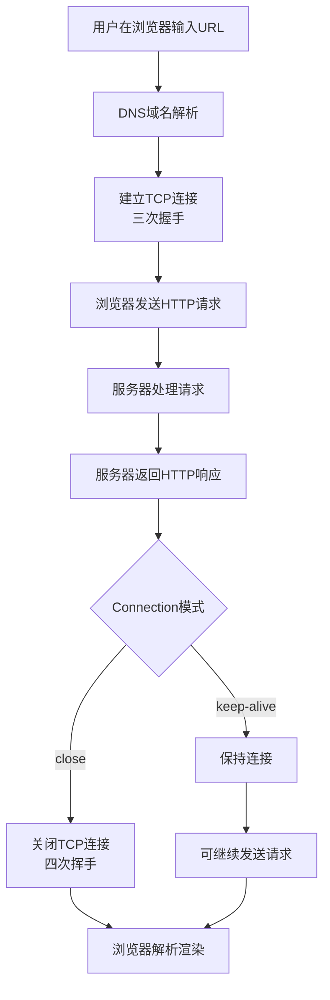

# 实习周总结二

本周并未完全按照计划走，而是加上学长的建议进行了一些动态的调整。本周进行了HTTP底层逻辑的复习，Vitest的学习---也是最主要的，同时将我的个人githubpages站点更换为VuePress框架并进行了自动化的githubpages打包上传部署


## HTTP

HTTP（超文本传输协议）是一种详细规定了浏览器和万维网服务器之间互相通信规则的应用层协议。它基于TCP/IP通信协议来传递数据，如HTML文件、图片文件、查询结果等。同时它是一种无连接，无状态并媒体独立的协议。

### 请求报文格式

```
请求行（方法、URL、协议版本）
请求头（多个键值对）
空行
请求体（可选，如POST提交的数据）
```

示例请求行：`GET /index.html HTTP/1.1`

### 响应报文格式

```
状态行（协议版本、状态码、状态描述）
响应头（多个键值对）
空行
响应体（如HTML文档）
```

示例状态行：`HTTP/1.1 200 OK`

### 常用HTTP方法

| 方法   | 描述               | 特点                         |
| ------ | ------------------ | ---------------------------- |
| GET    | 请求指定资源       | 参数通过URL传递，有长度限制  |
| POST   | 提交数据或上传资源 | 数据通过请求体传递，相对安全 |
| PUT    | 更新完整资源       | 幂等操作                     |
| DELETE | 删除指定资源       |                              |
| PATCH  | 部分更新资源       |                              |
| HEAD   | 只获取响应头       |                              |

### 常见HTTP状态码

- **1xx**：信息性状态码，表示请求已被接收，继续处理
- **2xx**：成功状态码，如200 OK（请求成功）
- **3xx**：重定向状态码，如302 Found（临时重定向）
- **4xx**：客户端错误状态码，如404 Not Found（请求资源不存在）
- **5xx**：服务器错误状态码，如500 Internal Server Error（服务器内部错误）

### 浏览器与服务器交互流程



### HTTP与HTTPS的区别

HTTPS在HTTP基础上加入SSL/TLS加密层，主要区别包括：

- HTTP是明文传输，HTTPS是加密传输
- HTTP默认端口80，HTTPS默认端口443
- HTTPS需要数字证书验证服务器身份
- HTTPS能防止数据窃取和篡改，更安全

总而言之，HTTP协议作为Web技术的基石，通过请求-响应模型实现了浏览器与服务器之间的高效通信。

## Vitest

以下是对我这周所学的Vitest核心知识的精要总结,详细的部分**请参考我博客文章**：[Vitest入门 | xh's blog](https://ksladnasx.github.io/vuepress_blog/posts/vitest.html)。

### Vitest 核心要点速览

| 核心领域         | 关键内容                                                     | 要点提示                                                     |
| ---------------- | ------------------------------------------------------------ | ------------------------------------------------------------ |
| **安装与配置**   | 1. 安装：`npm install -D vitest`                                                                                   2. 脚本：`package.json`中添加 `"test": "vitest"`                                                      3. 环境：`environment: 'jsdom'`(测试组件) 或 `'node'`(测试工具函数) | 确保 `vite.config.ts`正确配置了 Vue 插件 (`@vitejs/plugin-vue`)，以便识别 `.vue`文件 |
| **测试文件结构** | 1. `describe`：组织测试套件                                                                                               2. `it`/ `test`：定义单个测试用例                                                                                                   3. `expect`：进行断言判断 | 遵循 **Arrange-Act-Assert** (准备-执行-断言) 模式，让测试逻辑更清晰 |
| **测试方法**     | 1. **同步测试**：直接断言结果                                                                                                 2. **异步测试**：使用 `async/await`                                                                                               3. **Mock模拟**：`vi.fn()`模拟函数；`vi.mock()`模拟模块；`vi.spyOn()`监视对象方法                                                                                                                                              4. **触发事件**：`wrapper.trigger('click')` | Mock的核心是**隔离**和**控制**，让你能专注测试当前代码       |
| **测试类型**     | 1. **单元测试**：验证独立函数或组件                                                                                    2. **集成测试**：验证多个模块协作                                                                                        3. **E2E测试**：验证完整用户流程 | 利用Vitest做单元和集成测试，对于E2E测试，可搭配如Cypress的工具 |

### 测试的三步法则 (AAA)

有效的组件测试遵循"Arrange-Act-Assert"模式：

1. **Arrange（准备）**：设置测试环境和初始条件
2. **Act（执行）**：执行被测试的功能或行为
3. **Assert（断言）**：验证结果符合预期

```ts
it('increments counter when button is clicked', async () => {
  // Arrange
  const wrapper = mount(Counter, {
    props: {
      initialCount: 0
    }
  })
  
  // Act
  await wrapper.find('button').trigger('click')
  
  // Assert
  expect(wrapper.find('.count').text()).toBe('Count: 1')
})
```

### 实用技巧与常见问题

- •**加速测试**：使用 `it.concurrent`或 `describe.concurrent`实现测试并发执行 。
- •**精准测试**：用 `it.only`聚焦当前测试，`it.skip`跳过特定测试，`it.todo`标记计划编写的测试 。
- •**处理特定报错**：遇到如 `Unknown file extension ".css"`的错误，检查 Vitest 配置是否正确内联（`inline`）了相关依赖（如 `element-plus`），并确保已安装处理 `.vue`文件的插件 。

### 个人实战

我对于上周的echart组件进行了简单的测试文件撰写：

```ts
// tests/SalesChart.test.ts
import { describe, it, expect, vi, beforeEach, afterEach } from "vitest";
import { mount } from "@vue/test-utils";
import SalesChart from "../../src/views/SalesChart.vue";

vi.mock("echarts", () => ({
  init: vi.fn(() => ({
    setOption: vi.fn(),
    resize: vi.fn(),
    dispose: vi.fn(),
    on: vi.fn(),
    off: vi.fn(),
  })),
}));

describe("SalesChart.vue - 基础测试", () => {
  let wrapper: any;
  let mockChartInstance: any;

  // 每个测试前准备环境：清理 mock、创建 mockChartInstance、挂载组件
  beforeEach(async () => {
    vi.clearAllMocks();

    // 导入 echarts 并获取 mock 引用
    const echarts = await import("echarts");

    // 新建一个更容易断言的 mock 实例并让 echarts.init 返回它
    mockChartInstance = {
      setOption: vi.fn(),
      resize: vi.fn(),
      dispose: vi.fn(),
      on: vi.fn(),
      off: vi.fn(),
    };
    // 告诉 mocked init 返回我们创建的实例
    vi.mocked(echarts.init).mockReturnValue(mockChartInstance as any);

    // 挂载组件，组件在 onMounted 中使用 setTimeout(..., 0) 初始化图表
    wrapper = mount(SalesChart as any);

    // 等待微任务/宏任务队列执行完（组件使用 setTimeout(..., 0)）, 这里等待 0ms 即可
    await new Promise((resolve) => setTimeout(resolve, 0));
  });

  afterEach(() => {
    // 卸载组件并清理引用
    if (wrapper) {
      wrapper.unmount();
    }
    mockChartInstance = null;
  });

  it("应该正确渲染出图表容器和标题", () => {
    // 验证基本 DOM 结构
    expect(wrapper.find(".chart-container").exists()).toBe(true);
    expect(wrapper.find("h2").text()).toBe("销售数据统计");
    expect(wrapper.find(".chart").exists()).toBe(true);
  });

  it("使用默认数据时应初始化图表并设置初始 option", async () => {
    const echarts = await import("echarts");

    // echarts.init 应被调用一次以创建图表实例 
    expect(echarts.init).toHaveBeenCalledTimes(1);

    // 初始化时组件会调用一次 setOption 设置初始配置
    expect(mockChartInstance.setOption).toHaveBeenCalledTimes(1);

    // 验证 setOption 的参数包含 series 并且 series[0].data 等于组件 props 的默认数据
    const calledWith = mockChartInstance.setOption.mock.calls[0][0];
    expect(calledWith).toHaveProperty("series");
    expect(calledWith.series[0]).toHaveProperty("data");
    expect(Array.isArray(calledWith.series[0].data)).toBe(true);
  });

  it("当 chartData 属性变化时应调用 setOption 更新数据", async () => {
    // 清理之前的调用计数
    mockChartInstance.setOption.mockClear();

    // 更新 props，触发 watch 回调
    await wrapper.setProps({ chartData: [20, 25, 30] });

    // watch 触发后应至少调用一次 setOption 更新 series 数据
    expect(mockChartInstance.setOption).toHaveBeenCalled();

    // 获取最近一次调用参数，确认数据正确更新
    const lastCallArg = mockChartInstance.setOption.mock.calls.slice(-1)[0][0];
    expect(lastCallArg).toHaveProperty("series");
    expect(lastCallArg.series[0]).toHaveProperty("data");
    expect(lastCallArg.series[0].data).toEqual([20, 25, 30]);
  });
  it("",()=>{
    mockChartInstance.setOption.mockClear()
  })
}); 

```

同时还撰写了其他几个组件的测试文件，这里就一一展示了，附上我利于插件生成的覆盖率报告：


## VuePress博客搭建

我个人改用VuePress的原因主要是其对移动端适配特别友好，而且内置了主题的切换，不过相对来说牺牲了一些访问速度。

github地址：[ksladnasx/vuepress_blog](https://github.com/ksladnasx/vuepress_blog)

blog网站地址：[xh's blog](https://ksladnasx.github.io/vuepress_blog/)

#### 1. 项目初始化

首先创建项目目录并初始化：

```cmd
# 创建项目目录
mkdir my-vuepress-blog
cd my-vuepress-blog

# 初始化package.json
npm init -y

# 安装VuePress
npm install -D vuepress
```

#### 2. 创建基本文件结构

创建以下目录结构：

```cmd
my-vuepress-blog/
├── docs/
│   ├── .vuepress/
│   │   └── config.js  # 配置文件
│   └── README.md      # 首页
├── package.json
└── deploy.sh          # 部署脚本
```

在`docs/README.md`中添加基本内容：

```
---
home: true
heroImage: https://pic1.zhimg.com/v2-e75db3af3f5519bf8f95a6d61866f0e7_r.jpg
actions:
  - text: 开始
    link: /get-started.html
    type: primary

  - text: 介绍
    link: https://vuejs.press/guide/introduction.html
    type: secondary

features:
  - title: 简洁至上
    details: 以 Markdown 为中心的项目结构，帮助您专注于创作。
  - title: Vue 驱动
    details: 享受 Vue 的开发体验，可以在 Markdown 中使用 Vue 组件。
  - title: 高性能
    details: VuePress 会为每个页面预渲染生成静态的 HTML。

footer: MIT Licensed | Copyright © 2025-present VuePress Community
---
```

#### 3. 配置VuePress

创建`docs/.vuepress/config.js`文件，这是最重要的配置文件：

```js
module.exports = {
  title: '我的技术博客',
  description: '个人学习笔记和技术总结',
  base: '/my-vuepress-blog/', // 必须与GitHub仓库名一致
  head: [
    ['link', { rel: 'icon', href: '/favicon.ico' }]
  ],
  themeConfig: {
    nav: [
      { text: '首页', link: '/' },
      { text: '指南', link: '/guide/' }
    ],
    sidebar: {
      '/guide/': ['']
    }
  }
}
```

**关键点**：`base`配置必须设置为你的仓库名称，格式为`"/仓库名/"`，这是部署成功的核心。

#### 4. 配置package.json脚本

在`package.json`中添加构建命令：

```
{
  "scripts": {
    "docs:dev": "vuepress dev docs",
    "docs:build": "vuepress build docs"
  }
}
```

### 部署到GitHub Pages

#### 1. 创建GitHub仓库

在GitHub上创建一个新仓库，仓库名可以任意（如`my-vuepress-blog`），确保仓库为公开(public)状态。

#### 2. 创建部署脚本

在项目根目录创建`deploy.sh`文件，这是实现自动更新的关键：

```sh
#!/usr/bin/env sh

# 确保脚本抛出遇到的错误
set -e

echo "开始构建静态文件..."
npm run docs:build

echo "进入生成的文件夹..."
cd docs/.vuepress/dist

echo "初始化Git仓库..."
git init
git add -A
git commit -m 'deploy'

echo "添加远程仓库..."
git remote add origin git@github.com:ksladnasx/vuepress_blog.git || true

echo "强制推送到gh-pages分支..."
git push -f origin master:gh-pages

echo "部署成功！"
cd -
```

### 实现自动更新的工作流程

#### 第一次部署

1. 1.将代码推送到master分支：

```cmd
git init
git add .
git commit -m "初始化VuePress项目"
git branch -M main
git remote add origin https://github.com/yourusername/my-vuepress-blog.git
git push -u origin main
```

1. 2.切换到git bash并执行部署脚本：

```
sh ./deploy.sh
```

#### 配置GitHub Pages

1. 1.进入GitHub仓库的Settings → Pages
2. 2.在Source部分选择**gh-pages**分支
3. 3.点击Save，你的网站将在几分钟后可访问

#### 后续更新流程

当修改了Markdown文件后，只需要两个简单的步骤：

#### 1. 推送源码到main分支

```
git add .
git commit -m "更新文章内容"
git push origin main
```

#### 2. 重新执行部署脚本

```
./deploy.sh
```

这样，GitHub Pages页面就会自动更新为最新内容。