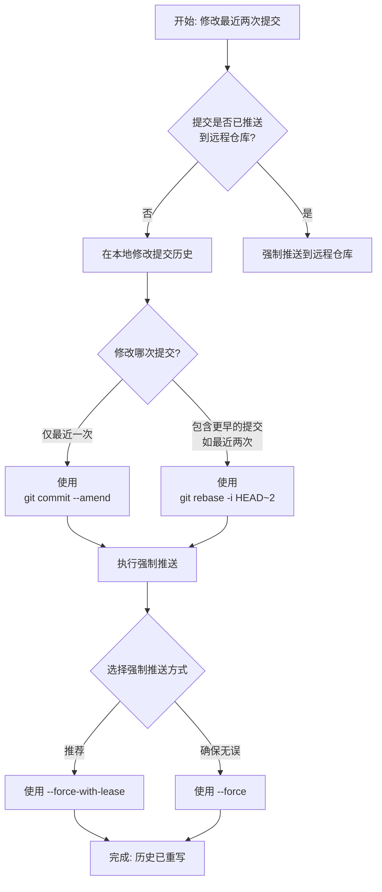

# 实习应该掌握的知识
## dynamic router

`router.hasRoute(name) && router.removeRoute(name)` 代码巧妙地利用了 `&&`运算符的短路特性,

它会先计算左侧的表达式的值，如果这个值可以转换为 `false`（如 `false`、`0`、`""`、`null`、`undefined`、`NaN`），那么整个表达式的结果就已经确定为这个假值，**右侧的表达式将不会被计算或执行**


```ts
// 全局路由守卫
router.beforeEach(async (to: RouteLocationNormalized, _: RouteLocationNormalized, next: any) => {
  NProgress.start() // 启动页面加载进度条

  // 判断该用户是否登录管理端
  if (getToken()) {
    // 如果已经登录
    if (to.path === '/login') {
      // 如果登录，并准备进入 login 页面，则重定向到主页
      next({ path: '/' })
    } else {
      // 检查用户是否已获得其权限角色
      // await store.dispatch('user/getMenus')
      //每次访问新路由前都​​清空​​现有的动态路由，确保路由表能根据用户最新权限更新。
      store.state.permission.dynamicRoutes.length = 0

      // 重新根据后端返回的对应用户的菜单构建路由
      resortDynamicRoutes(
        store.state.permission.dynamicRoutes,
        store.state.user.menus,
        backendStaticRoutes, //后端静态路由 - 完整的路由模板
        () => {}
      )
      next()
    }
  } else {
    // 如果没有 token
    if (whiteList.indexOf(to.path) !== -1) {
      // 如果在免登录的白名单中，则直接进入
      next()
    } else {
      // 其他没有访问权限的页面将被重定向到登录页面
      next('/login')
    }
  }
})
```

`store.state.permission.dynamicRoutes.length = 0`: 每次访问新路由前都**清空**现有的动态路由，确保路由表能根据用户最新权限更新。

`resortDynamicRoutes(...)`: 这是核心函数，根据后端返回的用户菜单列表 (`store.state.user.menus`)，在一个完整的路由模板 (`backendStaticRoutes`) 中**筛选并排序**出当前用户有权限访问的路由，然后添加到 `dynamicRoutes`中。这实现了**基于权限的动态路由加载**


下面一段用于**将后端返回的菜单数据转换为Vue Router动态路由**的核心函数，常见于后台管理系统的权限控制。其核心工作流程，是将后端菜单结构（`menu`）与前端预定义的路由模板（`backendStaticRoutes`）进行匹配、筛选和组装，最终生成用户有权限访问的动态路由列表。

```ts
export function resortDynamicRoutes(
  dynamicRoutes: RouteRecordRaw[], // 处理后的动态路由
  menu: any[], // 后台返回的用户菜单项
  backendStaticRoutes?: RouteRecordRaw[], // 后台静态路由
  beforePush?: Function // 路由加入前的回调
) {
  if (!menu.length) {
    console.warn('menu is empty')
    return
  }

  // 处理后台菜单
  menu.forEach((m) => {
    const asyncRoute = backendStaticRoutes?.find((r) => r.meta?.id === m.id)

    if (asyncRoute) {
      const dynamicRoute = cloneDeep(asyncRoute)
      dynamicRoute.children = undefined

      // 必定都有 meta，但 ts 限制，用 if 处理
      // 显示的菜单名以后台菜单为准
      if (dynamicRoute.meta && m.menuName) {
        dynamicRoute.meta.title = m.menuName
      }

      if (beforePush) {
        beforePush(dynamicRoute, m)
      }

      dynamicRoutes.push(dynamicRoute)

      // 递归处理后台子菜单
      if (m.childList && m.childList.length) {
        dynamicRoute.children = []
        resortDynamicRoutes(dynamicRoute.children, m.childList, asyncRoute.children, beforePush)
      }
    }
  })
}
```

### ⚙️ 函数参数详解

该函数接收四个参数，共同决定了动态路由的生成逻辑

- `dynamicRoutes: RouteRecordRaw[]`：一个**引用类型参数**，用于收集和存放所有处理完成后、有权限访问的路由对象。函数内部通过 `dynamicRoutes.push`填充此数组。
- `menu: any[]`：**后端返回的用户菜单列表**，定义了当前用户有权访问的菜单结构。它是生成路由的“骨架”或“白名单”。
- `backendStaticRoutes?: RouteRecordRaw[]`（可选）：前端预定义的**完整路由模板库**。可以理解为所有可用路由的“零件库”。函数会从其中挑选出 `menu`中允许的路由。
- `beforePush?: Function`（可选）：一个回调函数，允许在路由被添加到 `dynamicRoutes`之前，对其进行最后的自定义修改（例如，设置特定的 `meta`信息）。


## vue项目代码编写中commit()的作用

在Vue项目中，特别是在使用**Vuex**进行状态管理时，`commit()`方法扮演着至关重要的角色。它的核心作用是**唯一地、以同步方式修改Vuex Store中的状态（state）**，从而确保所有状态的变化都是可预测和可追踪的,是改变 Vuex 状态的**唯一途径**


简单VueX示例:

```js
// store/index.js
const store = new Vuex.Store({
  state: {
    count: 0
  },
  mutations: { // 定义 mutation
    INCREMENT (state) {
      state.count++
    },
    INCREMENT_BY (state, payload) {
      state.count += payload.amount
    }
  },
  actions: { // 定义 action（可包含异步操作）
    incrementAsync ({ commit }, payload) {
      setTimeout(() => {
        commit('INCREMENT_BY', payload) // 在 action 中提交 mutation
      }, 1000)
    }
  }
})

```

```vue
<!-- MyComponent.vue -->
<template>
  <div>
    <p>Count: {{ $store.state.count }}</p>
    <button @click="incrementSync">同步增加</button>
    <button @click="incrementAsync">异步增加</button>
  </div>
</template>

<script>
import { mapMutations } from 'vuex'

export default {
  methods: {
    ...mapMutations(['INCREMENT']), // 映射 mutation
    incrementSync() {
      this.INCREMENT() // 相当于 this.$store.commit('INCREMENT')
      // 或者直接提交载荷
      // this.$store.commit('INCREMENT_BY', { amount: 5 })
    },
    incrementAsync() {
      // 触发 action 处理异步
      this.$store.dispatch('incrementAsync', { amount: 10 })
    }
  }
}
</script>
```


## Git的使用

### 基本概念

分为暂存区，本地仓库和远程仓库

大概流程就是从远程仓库拉取代码后进行修改，修改后的代码文件可放在暂存区，然后可以将暂存区的文件commit到本地仓库，本地仓库在与远程的最新代码合并后可以进行对远程的提交

首先拉取远程仓库的内容到本地

```
git clone <仓库地址或ssh地址>
```


本地修改了之后将修改的文件放入暂存区

```
git add <文件名>

git add .     //将当前目录所有文件放入暂存区
```

然后可将暂存区的文件提交到本地仓库

```
git commit -m "提交理由"
```


最后推送到远端仓库

```
git pull  //更新最新代码

git push //推送到远端仓库
```

如果想要撤销已经推送到远程仓库的内容，需要先保证你的提交没有被人拉取

安全撤销：

1. 查看提交历史：`git log --online`
2. 找到你想撤销的那次提交的哈希值
3. 执行撤销命令`git revert <那次提交的哈希值>`
4. `wq` 保存退出（涉及一点vim操作）
5. 将一个撤销你之前更改的新提交推送到远程仓库 `git push`

如果想撤销撤销，一样的找hash值操作即可

### **修改之前提交的描述**

明白了，您是想修正最近两次提交的描述信息，而不是撤销提交本身。这个需求很常见，修改已推送的提交描述会改变Git历史，需要谨慎操作。下面的指南将帮您安全地完成修改。

#### **操作流程概览**

修改最近两次提交描述并更新到远程仓库的核心步骤如下，您可以根据提交是否已推送到远程仓库，以及是仅修改最近一次还是修改多次提交，参考后续的详细操作说明。



### 🛠️ 如何修改提交描述

##### 1. 修改最近一次提交

如果只需修改最近一次（即上一次）的提交描述，这是最简单的情况。

- **命令与操作**：

  ```
  # 这将打开默认编辑器（如Vim/VSCode），允许您修改提交信息
  git commit --amend
  ```

  在打开的编辑器中，修改提交描述，然后保存并退出。如果您想直接在命令行中完成，可以使用 `-m`选项直接指定新的描述：

  ```
  git commit --amend -m "新的、更清晰的提交描述"
  ```

##### 2. 修改最近两次（或任意多次）提交

如果您需要修改的提交包含倒数第二次甚至更早的提交，就需要使用交互式变基（Interactive Rebase）。

- **命令与操作**：

  ```
  # 这里的数字2表示要显示最近的2次提交，请根据您需要修改的提交数量调整
  git rebase -i HEAD~2
  ```

  执行命令后，会进入一个交互式界面。**请注意，这里列出的提交顺序是从最旧到最新**。找到您想修改的那次提交所在的行，将行首的 `pick`修改为 `reword`（或简写 `r`）。保存并关闭编辑器。

  随后，Git 会依次打开您标记为 `reword`的提交的描述编辑器，您就可以逐一修改它们了。每次修改完一个提交的描述后，Git 会自动继续处理下一个，直到所有标记的提交都修改完成。

#### ⚠️ 重要安全措施：推送到远程仓库

由于修改提交描述会改变提交的哈希值，从而**重写了Git历史**，在推送到远程仓库时，必须使用强制推送。

- **首选安全命令：`--force-with-lease`**

  这是目前**最推荐**的强制推送方式。它会检查远程分支在您上次拉取后是否有其他人推送了新的提交，如果没有才允许强制推送，有效避免覆盖同事的工作。

  ```
  git push --force-with-lease origin <您的分支名>
  ```

- **传统强制命令：`--force`（请谨慎使用）**

  这是传统的强制推送命令，它会**无条件地**用您的本地分支覆盖远程分支。如果在此期间有其他人推送了代码，他们的提交将会丢失。

  ```
  git push --force origin <您的分支名>
  ```

#### 💡 核心建议与注意事项

1. **团队协作第一**：如果您的分支是多人协作的共享分支，**在强制推送前，务必通知您的团队成员**。因为他们本地仓库的历史记录与远程已经不一致，强制推送后可能需要复杂的操作来同步。
2. **备份是好习惯**：在执行重写历史这类操作前，可以创建一个临时分支（如 `git branch backup-branch`）来备份当前状态，万一操作失误可以轻松回退。
3. **何时可以不用强制推送？**只有当您要修改的提交**还没有推送到远程仓库**（即仍然只存在于您的本地仓库）时，修改后可以直接使用 `git push`，无需强制推送。
4. **操作中断了怎么办？**如果在 `rebase -i`过程中遇到问题想中止，可以执行 `git rebase --abort`，一切将恢复到 rebase 开始前的状态。

希望这份详细的指南能帮助您顺利修正提交描述！如果您在操作过程的任何一步（比如解决冲突时）遇到问题，可以随时告诉我，我们可以继续深入探讨。

## git的推送的命名规范

在大型项目中使用规范的 Git 提交信息前缀，能极大提升团队协作效率和代码可维护性。下面这个表格整理了这些常用的专业词前缀及其含义和示例，方便你快速查阅。

| 前缀           | 含义与用途                                 | 示例                              |
| -------------- | ------------------------------------------ | --------------------------------- |
| **`feat`**     | 新增功能（feature）                        | `feat: 添加用户登录功能`          |
| **`fix`**      | 修复 bug                                   | `fix: 解决页面数据无法加载的问题` |
| **`docs`**     | 更新文档（documentation）                  | `docs: 更新 API 接口说明`         |
| **`style`**    | 代码风格调整（不影响逻辑，如空格、缩进）   | `style: 调整代码缩进格式`         |
| **`refactor`** | 代码重构（非新功能，非修复 bug）           | `refactor: 优化用户模块代码结构`  |
| **`perf`**     | 性能优化（performance）                    | `perf: 提升图片加载速度`          |
| **`test`**     | 增加或修改测试用例                         | `test: 为用户服务添加单元测试`    |
| **`chore`**    | 杂项更新（依赖、工具，非源码和测试）       | `chore: 更新项目依赖包版本`       |
| **`build`**    | 构建系统或外部依赖的改动                   | `build: 更新 Webpack 配置`        |
| **`ci`**       | 持续集成（Continuous Integration）配置更改 | `ci: 配置 GitHub Actions 工作流`  |
| **`revert`**   | 回滚之前的某个提交                         | `revert: 撤销某次功能更新`        |

### 💡 提交信息的最佳实践

除了使用规范的前缀，遵循以下几点能让你的提交记录更加清晰专业：

- •**格式规范**：提交信息的通用格式为 `前缀: 简要描述`。描述部分建议使用简洁的祈使句现在时态，例如用 "add" 而不是 "added" 或 "adds" 。
- •**保证原子性**：每次提交只专注一个改动点，例如修复一个独立的 bug 或新增一个单一功能。避免将多个不相关的修改一次性提交，这有助于后续代码审查和问题定位 。
- •**内容清晰简洁**：提交信息的主题行（第一行）应尽量控制在50个字符以内，做到简明扼要。如果需要更详细的说明，可以在主题行之后空一行，补充更具体的正文内容 。

### 🌰 一个完整的示例

```
feat: 实现图片上传功能

- 新增支持 JPEG、PNG 格式验证
- 添加上传进度条显示
- 增加文件大小限制（最大 10MB）

关联任务: PROJ-123
```


## Echart入门

基本的安装

```cmd
npm install echarts --save
```

一般都是子组件画图父组件引入

父组件传值

```vue
<template>
  <div>
    <!-- <BarChart :chart-data="salesData" /> -->
     <ZheX :chart-data="salesData" />
    <div class="update-btn">
        <button @click="updateData" >更新数据</button>
    </div>
    
  </div>
</template>

<script setup lang="ts">
import { ref } from 'vue';
// import BarChart from './BarChart.vue';
import ZheX from './ZheX.vue';

const salesData = ref([15, 25, 18, 32, 21, 28]);

const updateData = () => {
  salesData.value = salesData.value.map(() => 
    Math.floor(Math.random() * 40) + 5
  );
};
</script>

<style>
.update-btn{
    padding-top: 20px;
}
</style>
```

子组件通过接收的prop数据参数进行图标绘制

```vue
<template>
   <div class="chart-container">
        <h2>销售数据统计</h2>
        <div ref="chartRef" class="chart"></div>
    </div>
</template>

<script setup lang='ts'>
import { ref, onMounted, onUnmounted, watch } from 'vue';
import * as echarts from 'echarts';
import type { ECharts, EChartsOption } from 'echarts';

// 使用ref获取DOM元素
const chartRef = ref<HTMLDivElement>();
let myChart: ECharts | null = null;

// 定义props类型 
interface ChartProps {
    chartData: number[];
}

const props = withDefaults(defineProps<ChartProps>(), {
    chartData: () => [5, 20, 36, 10, 10, 20]
});


const getOption = (): EChartsOption => ({
    title: {
        text: '月度销售数据',
        left: 'left',
        textStyle: {
            color: '#333',
            fontSize: 16
        }
    },
    // 鼠标悬停提示框
    tooltip: {
        trigger: 'axis',
        axisPointer: {
            type: 'cross' //悬停显示的类型
        },
        formatter: '<strong>商品{b}</strong><br/>{a0}: {c0}件<br/>{a1}: {c1}件<br/>{a2}: {c2}件'
        // b0对应 series配置项中的 name属性的第一个
        // c0对应 对应 series.data中指定位置的具体数值的第一个
        // a0对应 ​对应 xAxis.data中指定位置的数据，通常表示横轴的标签的第一个
    },
    // 图例部分
    legend: {
        data: ['销量','买量','余量'],
        left: 'right', //对齐方式
        top: '5%'  //离顶部的距离
    },
 	// 配置ECharts图表的网格（grid）系统，决定了直角坐标系（例如常见的折线图、柱状图）的绘图区域在容器中的位置和大小
    grid: {
        left: '3%',
        right: '4%',
        bottom: '3%',
        containLabel: true
        //containLabel配置​​网格区域是否包含坐标轴的​​刻度标签
    },

    // 坐标轴配置
    xAxis: {
    type: 'category',
    data: ['A', 'B', 'C','D','E','F'],
  },
  yAxis: {
    type:'value'
  },
  series: [
    {
      name: '销量',
      data: props.chartData,
      type: 'line',
      color:'red',
    },
    {
        name:'余量',
        data:[25, 20, 50, 30, 55, 10],
        type:"bar",
        color:'pink',
        barWidth:'50%'
    },
    {
        name:"买量",
        data:[23,12,63,32,52,33],
        type:'line'
    }
  ]
});

//初始化函数
const initChart = () => {
    if (!chartRef.value) return;
    myChart = echarts.init(chartRef.value);
    myChart.setOption(getOption());
};
// 处理窗口 resize 事件
const handleResize = () => {
    myChart?.resize();
};

onMounted(() => {
    // 确保DOM已挂载后初始化图表
    setTimeout(() => {
        initChart();
        window.addEventListener('resize', handleResize);
    }, 0);
});


// 监听数据变化
watch(() => props.chartData, (newData) => {
    if (myChart) {
        myChart.setOption({
            series: [{
                data: newData
            }]
        });
    }
});

onUnmounted(() => {
    // 清理资源,销毁实例避免内存泄漏
    window.removeEventListener('resize', handleResize);
    myChart?.dispose();
});
</script>

<style scoped>
.chart-container {
    width: 100%;
    padding: 20px;
    background: #fff;
    border-radius: 8px;
    box-shadow: 0 2px 8px rgba(0, 0, 0, 0.1);
}

.chart-container h2 {
    margin-bottom: 20px;
    text-align: center;
    color: #333;
}

.chart {
    width: 100%;
    height: 400px;
}
</style>
```


其中，`getOption`用于对图表各类参数进行配置，

`initChart`函数用于初始化图表，在`onMounted`的时候调用这个初始化函数。

`onUnmounted`时记得清理资源,销毁实例避免内存泄漏


### dataset

 . **dataset 的优势** 

- **数据与配置分离**：数据在 `dataset`中独立管理，配置在 `series`中定义视觉映射
- **数据复用**：同一个数据集可以被多个系列或多个图表共享使用
- **动态更新**：只需更新源数据，所有相关图表自动同步更新

### 2. **transform 数据转换功能** 

| 转换类型    | 功能说明 |        应用场景         |
| ----------- | :------- | :---------------------: |
| `filter`    | 数据筛选 |    按条件过滤数据行     |
| `sort`      | 数据排序 | 按指定维度升序/降序排列 |
| `aggregate` | 数据聚合 | 分组统计、求和、平均等  |

### 3.**链式转换** 

```js
// 链式转换示例：先筛选再排序
transform: [
  {
    type: 'filter',
    config: { dimension: 'Category', '=': 'Electronics' }
  },
  {
    type: 'sort', 
    config: { dimension: 'Sales', order: 'desc' }
  }
]
```

### 4. **encode 数据映射** 

通过 `encode`配置将数据维度映射到图表视觉通道：

- `x`、`y`：映射到坐标轴
- `tooltip`：指定提示框显示内容
- `itemName`、`value`：用于饼图等图表

## Element

​	当你的Elemessage或者ElMessageBox出现显示故障时：

首先判断自己有没有重复导入，可能你全局导入 了El的样式然后单独的文件又撰写了类似`import { ElMessage, ElMessageBox } from 'element-plus'`的语句。

其次是添加自定义的类名，防止样式干扰：

```ts
ElMessageBox.confirm(
      '确定要取消配置吗？所有未保存的更改将丢失。',
      '确认取消',
      {
        confirmButtonText: '确定',
        cancelButtonText: '取消',
        type: 'warning',
        // 添加自定义类名用于样式控制
        customClass: 'cancel-confirm-dialog'
      }
```