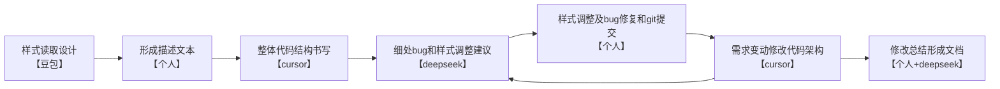

# 农担项目所遇问题及总结

## **组件封装**

代码中有很多处组件的封装，例如SVG图标的组件封装，在代码中对于icon的展示有独特的封装， 它并非简单的存储svg，而是只存储svg的核心部分，然后再使用`forwardRef`来实现封装并后期利用className等对svg样式进行修改。这样在代码后续调用的时候就可以对svg图标进行丰富的自定义和操作。

首先是导入方式，此处在svg的路径后使用了`?react`后缀，其目的是告诉Vite：将这个SVG文件转换为一个React组件，这样在转化后`Assistant`就是一个可以直接渲染的React组件：`<Assistant / >`

```tsx
import Assistant from "./assistant.svg?react";
```

然后在对于类型的定义中，`SVGSVGElement`：说明ref指向的是`<svg>`DOM元素，`& { className: any }`为合并类型，因为转换后的SVG组件可能有className属性便于后期样式修改。

转发实现部分为`((props, ref) =>{}`，接收外部的`ref`和`props`并直接传递给底层的SVG组件，相当于建立了一个"透明"的传递层。

```tsx
import Assistant from "./assistant.svg?react";

export const AssistantIcon = forwardRef<
    SVGSVGElement & { className: any },
    React.PropsWithChildren<{ className?: string }>
>((props, ref) => {
    return <Assistant ref={ref} {...props} />;
});
...	其余封装类似
```

那么后面使用很方便的一点就是，在简单的导入同时可以利用贴上的ref来直接操作SVG DOM，并且能实现灵活的svg样式控制，例如

```tsx
import { AssistantIcon, SkillIcon, FlowIcon } from './icons';

const iconRef = useRef<SVGSVGElement>(null);  //定义标签iconRef
useEffect(() => {
  if (iconRef.current) {     //对标签对应组件的各种操作(也就是AssistantIcon这个svg)
    const bbox = iconRef.current.getBBox();     // 获取SVG的边界框
    iconRef.current.animate(...);      // 给svg元素添加动画
  }
}, []);  //仅在组件挂载时执行一次
// 此处传递操作并通过className灵活修改改样式
<AssistantIcon ref={iconRef}  className="w-6 h-6 text-red-500 hover:text-blue-500"/>;  //贴上iconRef标签
```


## **forwardRef**

### 定义

**`React.forwardRef`**是一个**高阶函数**，用于创建一个React组件。主要目的是让组件能够接收从其父组件传递下来的 `ref`，并将其“转发”到组件内部的某个具体的DOM元素或子组件。

### forwardRef接收的参数类型 

其中`forwardRef<T, P>` 接受两个泛型参数：

- **`T`**：`ref` 指向的**元素类型**
- **`P`**：组件接受的 **props 类型**

例如`forwardRef<SVGSVGElement & { className: any },    React.PropsWithChildren<{ className?: string }> >`中：

第一个参数：`SVGSVGElement & { className: any }`表示 `ref.current` 将是一个 **SVG `<svg>` 元素**，定义了ref这个标签指向的类型。在创建标签的时候就`const iconRef = useRef<SVGSVGElement>(null); // 这样声明ref就够了`

第二个参数这里是一个**工具类型**，它定义你传的prop只能有className或者children（或者两个都传），例如;

```tsx
/** 此处的props对象为：{ className: "icon-large", children:[
    "<span>图标</span>",
    "点击我" ]} 
 **/
<AssistantIcon className="icon-large">
   <span>图标</span> 点击我
</AssistantIcon>
```

### 代码样例

其实代码中很多地方还有类似的封装，例如对于各种卡片的样式部分，对卡片头部也有类似封装，其中 泛型 `<HTMLDivElement, ...>` 指定了ref指向的目标类型（一个div）和组件的属性类型：

```tsx
// 1. 使用 `forwardRef` 创建一个可以转发 ref 的组件
const CardHeader = React.forwardRef< 
    HTMLDivElement, // ref最终将被附加到的元素类型（这里是HTMLDivElement）
    React.HTMLAttributes<HTMLDivElement>   // 组件可以接收的所有props类型（包括所有标准div属性）
>( // 2. `forwardRef` 接收一个渲染函数作为参数，这个函数会接收 `props` 和从父组件传下来的 `ref` 作为其两个参数
        ({ className, ...props }, ref) => ( 
        // 3. 在内部，将 `ref` 和 `props` 都绑定到目标元素（div）上
    <div
        ref={ref}
        className={cname("flex flex-col space-y-1.5 p-5 pb-4", className)}
        {...props}
    />
        )
    )

// 4. 为组件设置一个清晰的 displayName，便于在React DevTools中调试
CardHeader.displayName = "CardHeader"
```

此处的ref可以理解为一个**“直接访问标记”**。他就像是给某个组件贴了一个带把手的名牌，那便可以通过这个**把手**（`ref.current`）直接**拉住**组件进行操作，而不是去通过React的正常“传话”系统（props和state）去间接影响它。因此修改`.current`**不会**触发重渲染儿修改state会触发重新渲染。

```tsx
import { useRef } from 'react';

function CardComponent() {
  // 创建ref，指定类型为HTMLDivElement（与forwardRef的泛型一致）
  const headerRef = useRef<HTMLDivElement>(null);

  const handleClick = () => {
    if (headerRef.current) {   //利用标签进行DOM元素的直接操作
      headerRef.current.style.backgroundColor = '#f0f9ff';
      headerRef.current.scrollIntoView({ behavior: 'smooth' });
    }
  };

  return (
    <div>
      <CardHeader ref={headerRef} className="cursor-pointer">  //贴上标签headerRef，同时还传递自定义类名修改样式
        内容
      </CardHeader>
      <button onClick={handleClick}>高亮头部</button>
    </div>
  );
}
```

## 开会与vibe coding

周五还进行了开会，主要内容对于我来讲，就是改变自己编码者的身份，而更多的成为代码的审查者和一个架构者，对于能用ai完成的部分尽量用ai来提升效率，而对于我开发人员来讲，主要就是对代码和业务逻辑的宏观架构和调控。让ai写代码的时候就要更加考虑业务逻辑和代码的优化和后续的维护，而非功能的实现。当然也讲解了智能体的实现等等相关内容。

**Vibe Coding** 是一个与 AI 结对编程的终极工作流程，旨在帮助开发者丝滑地将想法变为现实。本指南详细介绍了从项目构思、技术选型、实施规划到具体开发、调试和扩展的全过程，强调以**规划驱动**和**模块化**为核心，避免让 AI 失控导致项目混乱。这里我还找到了一个食用指南：[vibe-coding-cn](https://github.com/tukuaiai/vibe-coding-cn)

当然在ai使用中有很多导致错误的坑，例如对这次项目来说ai修改很坑的一点是改的不完全，例如对于logo判断这里应该是：

```tsx
 {logo ? (typeof logo === 'string' ? 
                            <div className="max-w-6 min-w-6 max-h-6 rounded-full overflow-hidden bg-transparent">
                                
                            </div>
                            : <div className="w-6 h-6 min-w-6 flex justify-center items-center bg-transparent">
                                {logo}
                            </div>
                        ) : <div className="w-8 h-8 min-w-6 flex justify-center items-center bg-transparent" >
                                {/* <AvatarIcon /> */}
                                
                            </div>}
```

但是ai有些地方改了有些地方没改，导致后续的logo展示就会有地方展示失败。还有就是对于类名写错的情况，例如对于类名中间加空格导致react没法正常识别出现bug，ai并不能正常的进行识别。这里的h-[calc(100%-104px)]写成了h-[calc(100% - 104px)] 都没法识别，无效改了半天，浪费了时间。


## 项目git拉取

这个地方有个坑，如果你直接点分支的右上角那个clone按钮复制链接进行git clone,得到的是main分支下的文件而非你所想要的那个分支。正确的方法应该是 克隆的时候克隆指定分支，如这里是customer/cqnd/main分支：

```cmd
git clone -b customer/cqnd/main git@git.un-net.com:unnet-llm/adp/postwise.git
```

这样获得的文件才是你想要的那个分支的。


## 项目启动但无法访问页面

先排查路由文件，路由文件没问题通过命令行进行curl查看

```cmd
curl http://localhost:4001/workspace
```

如果返回`curl: (52) Empty reply from server`表示服务器接受了连接，但没有返回任何数据就关闭了连接。有几种可能的原因和解决方法：

###  检查端口占用

这里我是4001端口

```bash
# 查找哪个进程在使用 4001 端口
netstat -ano | findstr :4001
# 记下 PID，然后在任务管理器中查看
```

返回结果：

```bash
C:\Users\wh826>netstat -ano | findstr :4001
  TCP    0.0.0.0:4001           0.0.0.0:0              LISTENING       19416
  TCP    127.0.0.1:4001         0.0.0.0:0              LISTENING       6112
  TCP    127.0.0.1:4001         127.0.0.1:51385        TIME_WAIT       0
  TCP    127.0.0.1:4001         127.0.0.1:58250        TIME_WAIT       0
  TCP    127.0.0.1:50096        127.0.0.1:4001         TIME_WAIT       0
  TCP    127.0.0.1:59318        127.0.0.1:4001         TIME_WAIT       0
```

显然看前两个，后面的是回环端口，发现两个进程在争夺同一个端口，则使用 PowerShell进行进程id查看

```powershell
Get-Process -Id 19416,6112
```

然后停止其中的进程或者应用

```powershell
taskkill /PID 6112 /F
```


## 下载请求得到undefine

这个是Blob的解析异常，应该首先看axios的拦截器，有些返回的是response.data导致请求异常，当响应是 Blob 类型（如下载文件）时，拦截器中的 `response.data` 会被自动转换，这可能导致错误。这里需要对响应拦截器进行修改，增加对于blob类型的响应的判断，如果是此类型直接返回response。或者直接选择绕过利用fetch进行请求。

增加blob类型的响应的判断判断:

```ts
customAxios.interceptors.response.use(function (response) {
    // 检查是否是 blob 响应 ,对于 blob 响应，直接返回 response 而不是 response.data
    if (response.config.responseType === 'blob' || 
        response.headers['content-type']?.includes('application/octet-stream') ||
        response.headers['content-type']?.includes('application/vnd.ms-excel') ||
        response.headers['content-type']?.includes('application/pdf')) {
    
      return response;
    }
    .....后续代码
}
```

那么对应的请求应该规定好返回的类型(这里定义好了返回类型是AxiosResponse，方便后续处理)：

```ts
import { AxiosResponse } from "axios";
import axios from "../request";

//下载知识库文件，规定好responseType
export async function downloadFile(knowledge_id:number, file_id:number): Promise<import('axios').AxiosResponse> {
  const token = localStorage.getItem('ws_token');
  return axios.get(`/api/v2/filelib/knowledge/file/download/${knowledge_id}/${file_id}`, {
    responseType: 'blob',
  })
}
```

## 文件下载

在前面配置好然后就能调用请求进行文件下载了，这里的外层包裹的函数 captureAndAlertRequestErrorHoc是用于对抛出的错误消息进行处理并展示弹窗。同时注意如果下载请求返回的数据类型是json的说明请求遇到错误则抛出异常：

```ts
const handleDownload = (file) => {
        captureAndAlertRequestErrorHoc(
            downloadFile(Number(id), file.id).then(async (response) => {
                // 检查响应内容类型，注意：现在 response 是 AxiosResponse 对象
                const contentType = response.headers['content-type'] || '';

                // 如果返回的是 JSON（可能是错误响应），先检查
                if (contentType.includes('application/json')) {
                    // Axios 中，response.data 已经是 blob，需要转换为文本再解析
                    const text = await new Promise((resolve, reject) => {
                        const reader = new FileReader();
                        reader.onload = () => resolve(reader.result);
                        reader.onerror = reject;
                        reader.readAsText(response.data);
                    });

                    const errorData = text ? JSON.parse(text as string) : {};
                    if (errorData.status_code && errorData.status_code !== 200) {
                        throw new Error(`下载失败: ${errorData.status_message || errorData.message || errorData.status_code}`);
                    }
                }
                if (response.status !== 200) {
                    throw new Error(`下载失败: ${response.status} ${response.statusText}`);
                }

                // response.data 已经是 blob 数据，因为设置了 responseType: 'blob'
                const blob = response.data;
                // 检查 blob 是否有效
                if (!blob || blob.size === 0) {
                    throw new Error('下载失败: 文件内容为空');
                }

                // 使用原始文件名
                let fileName = file.file_name;

                // 创建临时 URL 和下载链接
                const downloadUrl = window.URL.createObjectURL(blob);
                const link = document.createElement('a');
                link.href = downloadUrl;
                link.download = fileName;
                document.body.appendChild(link);
                link.click();
                document.body.removeChild(link);
                window.URL.revokeObjectURL(downloadUrl);
            })
        );
    }
```


## react基础学习

 React 的三大核心概念：**JSX**、**组件 & Props**、**Hooks**。

### 一、JSX：JavaScript + XML

它是一种 JavaScript 的语法扩展，允许你在 JavaScript 代码中直接书写类似 HTML 的结构，用来**描述 UI 应该是什么样子**。

**核心要点**：

1. **它不是字符串，也不是HTML**，最终会被编译成普通的 JavaScript 对象（React 元素）。
2. **必须有一个根元素**。早期必须用 `<div>` 包裹，现在推荐使用空的 `<>`（片段）包裹，避免添加无意义的 DOM 节点。
3. **在 JSX 中嵌入 JavaScript 表达式**：使用单花括号 `{}`。这可以是变量、函数调用，或者任何返回值的表达式。
4. **属性名采用小驼峰命名**：例如 `class` 要写成 `className`，`onclick` 要写成 `onClick`。
5. **JSX 本身也是一个表达式**：可以在 `if` 语句、`for` 循环中使用，可以赋值给变量，也可以作为函数的参数或返回值。

```jsx
// 嵌入 JavaScript 表达式
const name = 'Alice';
const element = <h1>Hello, {name}</h1>;

// JSX 也是一个表达式，可以在条件或循环中使用
const showWelcome = true;
const greeting = (
  <>
    {showWelcome ? <h1>Welcome!</h1> : <h1>Please Login</h1>}
    <ul>
      {['Task 1', 'Task 2'].map((item) => (
        <li key={item}>{item}</li>
      ))}
    </ul>
  </>
);
```


### 二、组件与 Props

**组件**是 React 应用的**构建块**。每个组件都是一个独立的、可复用的 UI 片段。

- **定义组件**：就是一个返回 JSX 的 **JavaScript 函数**。**函数名必须以大写字母开头**（这是 React 区分组件和原生 HTML 标签的方式）。
- **使用组件**：像使用 HTML 标签一样使用它 `<Welcome />`。
- **Props**：是组件的 **“输入参数”** ，用于父组件向子组件传递数据。它是以属性形式写在组件标签上的，组件函数通过第一个参数（通常命名为 `props`）接收。**Props 是只读的**，组件不能修改自己的 props。

```jsx
// 1. 定义一个组件 (函数名大写！)
function Welcome(props) { // props 接收传入的数据
  // props 是只读的
  return <h1>Hello, {props.name}</h1>;
}

// 2. 使用组件，并传递 props (name="Sara")
function App() {
  return (
    <div>
      <Welcome name="Sara" />
      <Welcome name="Cahal" />
      <Welcome name="Edite" />
    </div>
  );
}

//或者循环调用，注意 name={item} 才会传递动态值即传递数组中的数字值，且要加 key 属性
const userList = [
  { id: 101, name: '张三', age: 25 },
  { id: 102, name: '李四', age: 30 },
  { id: 103, name: '王五', age: 28 }
];
function UserList() {
  return (
    <div className="user-list">
      <h2>用户列表</h2>
      {userList.map(user => (
        <Welcome 
          key={user.id}          // 使用唯一 id 作为 key
          name={user.name} 
          age={user.age}
        />
      ))}
    </div>
  );
}

```


**⚠️ 一个关键规则**：**永远不要在组件内部定义另一个组件**。这会导致每次父组件渲染时，子组件都被重新创建和卸载，导致性能问题和状态丢失。正确的做法是将每个组件定义在模块顶层。

```jsx
// ❌ 错误！禁止在组件内定义组件
function App() {
  function Welcome() { // 每次 App 渲染都会重新定义 Welcome
    return <h1>Hello</h1>;
  }
  return <Welcome />;
}

// ✅ 正确！将组件定义在顶层
function Welcome() {
  return <h1>Hello</h1>;
}
function App() {
  return <Welcome />;
}
```


### 三、Hooks：状态和生命周期

在 Hooks 出现之前，函数组件只能接收 props 渲染 UI，没有状态和生命周期。**Hooks 是一系列以 `use` 开头的特殊函数，它们让你能在函数组件中使用 React 的各种特性**。

**两个最核心的 Hook**：

1. **`useState` - 管理状态**

   - **作用**：在函数组件中添加内部可变的“状态”（state）。
   - **返回值**：返回一个包含两个元素的数组：`[当前状态值, 更新状态的函数]`。
   - **更新状态**：必须使用它返回的 `set` 函数来更新，直接修改 state 变量不会触发重新渲染。

   ```jsx
   import { useState } from 'react';
   function Counter() {
     // count 是当前状态值，setCount 是更新它的函数
     const [count, setCount] = useState(0); // 初始状态为 0
     return (
       <button onClick={() => setCount(count + 1)}>
         You clicked {count} times
       </button>
     );
   }
   ```

   

2. **`useEffect` - 处理副作用**

   - **作用**：让你在函数组件中执行副作用操作。**副作用**是指那些与渲染结果无关的操作，如数据获取、订阅、手动修改 DOM 等。
   - **执行时机**：默认情况下，它在 **每次组件渲染完成后**（包括首次渲染）执行。
   - **依赖数组**：第二个参数是一个数组，用于控制 effect 的执行条件。这是优化性能的关键。
     - `useEffect(fn)`：**无依赖数组**，每次渲染都执行。
     - `useEffect(fn, [])`：**空数组**，仅在组件挂载时执行一次（类似 vue中的`onMounted`），。
     - `useEffect(fn, [a, b])`：**依赖项数组**，当 `a` 或 `b` 的值发生变化时才执行。

   ```tsx
   import { useState, useEffect } from 'react';
   function Timer() {
     const [seconds, setSeconds] = useState(0);
     useEffect(() => {
       // 这是一个副作用：设置定时器
       const intervalId = setInterval(() => {
         setSeconds(s => s + 1);
       }, 1000);
       // 清理函数：在组件卸载或下一次 effect 执行前运行
       return () => clearInterval(intervalId);
     }, []); // 空依赖数组，表示此 effect 只在组件挂载时运行一次
     return <div>Seconds: {seconds}</div>;
   }
   ```

**Hooks 使用规则（铁律）**：

- **只在 React 函数的最顶层调用 Hook**。不要在循环、条件判断或嵌套函数中调用。
- **只在 React 函数组件或自定义 Hook 中调用 Hook**。不要在普通的 JavaScript 函数中调用。

### 总结与关系

你可以这样理解它们的关系：你用 **JSX** 语法在 **组件** 的函数体内描述 UI 结构；父组件通过 **Props** 将数据和控制逻辑传递下来；组件内部用 **Hooks** 来管理自己的状态（`useState`）和响应外部世界的变化（`useEffect`）。这三者共同构成了一个 React 组件的完整逻辑。


## 样式修改

h-[calc(100%-104px)]：含义是父元素的100%减去固定的104px，适配不同缩放比例且依赖父元素，

h-[calc(100rem-104px)]: 页面整体的字体大小100倍减去104px，会出现页面缩放但是聊天界面不适配的情况（过小或过大）

对于页面样式要通过justify-between将卡片均匀分布在容器中展示，同时使用不同的媒体查询参数进行卡片间隙的动态变化，如`2xl:gap-8`，表示：

```css
@media (min-width: 1536px) {
    .\32xl\:gap-8 {
        gap: 2rem /* 32px */ !important;
    }
}
```

与后端实习生以及毛学长进行了一些简单的crud接口对接。。。

对avatar的图片处理逻辑进行优化，如果图片加载异常，不再使用默认图标

这里的table有源代码的封装，要进行一定样式的传递


## 代码逻辑

### 页面创建逻辑

首先明确一点的是，在  `src\components `文件夹下是存放着各种可在各个页面中通用复用的组件，这个应该是源代码中编写自带的，例如分页的组件**AutoPagination**。这种在各个页面中用到时，只需要在用到时进行导入并传入需要的参数即可。

```tsx
<div className="postwise-table-footer bg-background-login">
            <p></p>
            <AutoPagination
                className="float-right justify-end w-full mr-6"
                page={page}
                pageSize={pageSize}
                total={total}
                onChange={(newPage) => setPage(newPage)}
            />
</div>
```

而在项目的具体页面撰写中，以SystemPage模块的代码组织为例，通常遵循以下结构：首先创建名为 `System` 的目录，并在其中建立入口文件 `index.tsx` 以及 `components` 子文件夹。`components` 文件夹中存放各个独立页面组件，例如 `User` 组件与 `Config` 组件，每个组件对应一个具体页面。在每个组件内部，可以编写所需的各种功能函数与 Hook 等处理逻辑，也可以对其他的组件进行引入使用，但仅通过一个默认导出（`export default`）对外暴露该组件。

随后，在 `index.tsx` 中集中导入这些组件，并在页面中进行相应的组合与渲染。最终，该 `index.tsx` 文件可在路由配置中被引入，从而集成到整体应用的路由体系中。

```tsx
import Users from "./components/Users"....;

export default function index() {
    const { user } = useContext(userContext);
    const { t } = useTranslation()
    return <div className="w-full h-full px-2 pt-4">
        <Tabs defaultValue="user" className="w-full">
            <TabsList className="h-full">
                <TabsTrigger value="user" className="h-full">{t('system.userManagement')}</TabsTrigger>
                {user.role === 'admin' && <TabsTrigger value="userGroup" className="h-full">{t('system.userGroupsM')}</TabsTrigger>}
                <TabsTrigger value="role" className="h-full">{t('system.roleManagement')}</TabsTrigger>
            </TabsList>
            <TabsContent value="user">
                <Users></Users>
            </TabsContent>
            。。。其他代码
             </div>
};
```

### 组件封装逻辑

在上文提到，在 `src\components `文件夹下封装着各种可在各个页面中通用复用的组件，例如Table组件，是封装在`src\components\bs-ui\table\index.tsx`下的，他不是仅仅对table进行封装，而是对表头，表项，表行等各种原子组件进行了一个封装，这有便于后续更加个性化的导入使用。

这里的封装就是利用了forwardRef和各种props来达到更加个性化的目的，这在之前的总结总已经提到过。

```tsx
import * as React from "react"
import { cname } from "../utils"

const Table = React.forwardRef<
    HTMLTableElement,
    React.HTMLAttributes<HTMLTableElement>
>(({ className, ...props }, ref) => (
    <div className={cname("relative w-full", props.onScroll ? "" : "overflow-auto")}>
        <table
            ref={ref}
            className={cname("w-full caption-bottom text-sm border-separate border-spacing-y-1", className)}
            {...props}
        />
    </div>
))
Table.displayName = "Table"
```

这里在调用这些封装的组件的时候，如果想要传递width: '100%'这种非className的样式信息，则需要作为props传入，对应会传递到上面代码中的`{...props}`中去，会对应在table中实现，这里是调用示例：

```tsx
import { Table,  TableBody,  TableRow ,.... 其他封装的组件} from "../../../components/bs-ui/table";

<Table 
  className="mb-[50px]" 
  style={{ tableLayout: 'fixed', width: '100%', minWidth: '1384px' } as any}
>
```


### 请求撰写逻辑

在项目中，对于请求的撰写函数是专门放在 controllers文件夹下的，文件夹下是request.ts文件和API文件夹，其中request中是对于请求基地址，token等每个请求的公共参数，以及请求拦截器和响应拦截器的封装。响应拦截器可对不同状态的请求响应进行判断和拒绝信息返回。并且响应拦截器对于不同类型的响应也要有不同的判断返回，例如这里对于blob数据的响应返回：

```ts
customAxios.interceptors.response.use(function (response) {
    // 检查是否是 blob 响应 ,对于 blob 响应，直接返回 response 而不是 response.data
    if (response.config.responseType === 'blob' || 
        response.headers['content-type']?.includes('application/octet-stream') ||
        response.headers['content-type']?.includes('application/vnd.ms-excel') ||
        response.headers['content-type']?.includes('application/pdf')) {
    
      return response;
    }
```

除此之外request.ts中还对接口异常提示弹窗进行了封装导出，主要用于可视化弹出error信息：

```ts
export function captureAndAlertRequestErrorHoc(apiFunc, iocFunc?) {
    return apiFunc.catch(error => {
        if (error === null) return // app error
        if (error?.code === "ERR_CANCELED") return 'canceled'
        console.log('error :>> ', error);
         //如果error是一个对象，则提取对象属性
        const errorMessage = error instanceof Error ? 
                    error.message : 
                    (typeof error === 'string' ? error : JSON.stringify(error))
        iocFunc?.(error)
        toast({  // 弹窗
            title: `${i18next.t('prompt')}`,
            variant: 'error',
            description: errorMessage
        })
        console.error('逻辑异常 :>> ', error);
        return false
    })
};
```

然后API文件下就是各种请求的撰写，当然得分不同的文件名称，不同名称的文件处理不同的组件页面的请求。后续需要进行请求导入请求函数进行请求即可。请求的时候外层加上封装的接口异常提示弹窗，并加上.then处理，大概格式如下：

```ts
return captureAndAlertRequestErrorHoc(overridComponent(请求所需的data)).then(res => {
                对请求返回的res数据进行操作 }
)
```

### 组件渲染逻辑

我在代码撰写的时候出现弹窗的无限渲染的错误，究其原因是在React 渲染过程中直接调用可能触发重新渲染的函数导致的无限重复渲染。基本错误逻辑就是：**在渲染过程中直接执行副作用** → 副作用触发重新渲染 → 再次执行副作用 → 无限循环。

React 组件会因各种原因多次渲染（父组件更新、状态变化等），而副作用函数本身可能触发重新渲染（如某些 toast 实现会更新全局状态）：**渲染 + 副作用 + 重新渲染 = 死循环**

这里的toast弹窗会导致父组件的重新渲染，而重新渲染的时候又会再次执行这个弹窗，又会重新渲染，就会导致无限循环。因此需要将`toast()` 放在事件回调或 `useEffect` 中 而不是放在渲染逻辑中：

```javascript
// ❌ 错误：每次渲染都执行
if (error) {
    toast("错误");  // 直接调用
    return <div>错误状态</div>;
}

// ✅ 正确：只在特定时机执行
useEffect(() => {
    if (error) toast("错误");
}, [error]);
```

因此应该保证：

- **渲染函数应该是纯的**：不直接修改外部状态
- **副作用应该隔离**：放在 `useEffect` 或事件回调中
- **假设组件会多次渲染**：代码要能安全应对重复执行

同时注意区分useState和useRef：

```tsx
// useState - 重新渲染时会重置
const [state, setState] = useState(false);
// 每次重新渲染：state 会被 React 重新管理

// useRef - 重新渲染时保持
const ref = useRef(false);
// 每次重新渲染：ref.current 保持上次的值
```

那么便可以使用 `useEffect` + `useRef` 来确保副作用只执行一次，**一句话总结**就是别在 React 渲染过程中直接调用可能触发重新渲染的函数，用 `useEffect` 隔离副作用：

```javascript
const hasShown = useRef(false);
useEffect(() => {
    if (error && !hasShown.current) {
        hasShown.current = true;
        toast("错误");
    }
}, [error]);
```


## Vibe coding方法论

个人在coding的时候大部分是用的ai进行辅助编程，这大体也让我发现了各个ai其中的弊端及其用法。

由于大部分内容的修改实际并不涉及过于深入过于复杂的逻辑撰写，实际上我还是在使用cursor（auto）+国产模型的组合，为此还专门搞了个cursor账号（小贵，要是公司能报销就好了QwQ）。

然后在我撰写的过程中，我大概发现了ai的各类使用方法。对于cursor，还是适合宏观的代码读取阐述和代码框架结构构建，但是对于代码的局部细致部分结构修改，例如我只是想修改一下背景样式之类的，由于cursor的宏观读取代码的能力，反而会造成一些完全没必要的撰写（例如从某个犄角旮旯调用个组件来复用什么的），对于这类问题，个人觉得还是使用deepseek，复制代码片段直接问方案，然后加上自己的判断比较方便，也能对个人的代码撰写理解有所提示。当然注意使用deepseek的时候别开深度思考，这样才会调用他最新的v3模型。能力更强。至于豆包？虽然看着有点傻（实际上也是），但是他更适合多模态文件的读取，例如git仓库的读取阐述以及样式设计图的读取并给出样式修改意见。

所以我代码撰写大概的逻辑就是：



总结而言，要与时俱进，减少个人代码撰写量，更多的是需求的理解和代码架构的设计，从编程者变成宏观调控和代码审查者。在我所看的vibe coding 相关的文献资料中，其所对于ai的辅助撰写流程大体分为四个层面

### 提示词设计与交互层面

在提示词设计与交互层面，整体遵循 “精准、简洁、结构化” 的核心原则：输出需剔除客套、修辞等冗余内容，仅保留事实与结论，优先保证准确性而非速度或客套性，信息不足时需标注假设与不确定性来源；总结类输出仅在明确要求时生成，且需简短、无重复、聚焦高价值信息，避免冗余标题；多语言交互以用户提问语言为核心，引用代码元素、文件时必须用反引号标注，工具调用类提示词则限定仅使用指定工具，并行化独立操作、序列化依赖 / 冲突操作，且每批次工具调用前需附加简短的目的或结果说明，高频操作后需暂停给出精简进度节点，同时跳过无意义的客套回应，直接以目标导向的表述开启交互。

### 任务规划和执行层面

任务规划与执行环节区分任务复杂度制定不同策略：简单任务直接给出执行指导，复杂任务需拆解为可验证的小步骤，将同文件的相关修改归为单一任务，每个实现步骤后紧跟验证环节，避免批量实现后统一验证，任务规划从基础准备工作起步，以集成测试收尾，且未实际执行的任务绝不标记完成；代码编写需从全注释的逐行代码入手，配套算法、复杂度等详细解释，数学公式统一用 LaTeX 呈现，同时避免重复现有代码，以注释占位不变代码段。

### 代码审查层面

在代码审查层面，构建可量化、可审计的体系。将健壮性、安全性、性能等审查维度拆解为可判定的检查点（CP），每个检查点明确定义、必要性、验证方法与通过标准，标记未知项和维度间的潜在冲突，形成标准化清单而非模糊建议；质量评估围绕可判定性、覆盖完整性、可验证性等五个维度展开，要求检查点覆盖设计、实现、运维等全环节，高风险系统需补充审计日志、权限边界等专项检查，信息不足处需标注 “Unknown” 并给出补充动作，彻底摒弃无落地性的笼统建议。

### 结构呈现与持续优化层面

在结果呈现与持续优化层面，输出需兼顾可读性与实用性：标题层级清晰且适配内容，可添加少量专业 emoji 提升扫描效率，文件变更需标注用途，性能指标基于实际运行数据并注明硬件 / 系统上下文，终端命令保证可复制且分行呈现；任务完成后需精简总结变更内容与验证方式，同时在实施、调试、优化或出现意外后进行针对性反思，提炼模式、根本原因与经验教训；对话中的建议或追问需控制数量，单条仅承载一个清晰观点，避免信息过载，确保人机协作始终聚焦核心目标。


