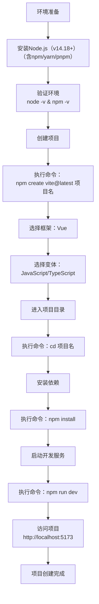

# Vue3探索

## 方法一：使用Vite创建项目（推荐）

Vite是当前最流行的Vue3项目构建工具，具有极快的启动速度。




1. **确保环境准备**

   - 安装Node.js 14.18+版本（Vue3最低要求）

   - 验证安装：

     ```cmd
     node -v
     npm -v
     ```

2. **创建项目**

   ```cmd
   npm create vite@latest my-vue3-ts-app -- --template vue-ts
   ```

   或使用yarn/pnpm：

   ```cmd
   yarn create vite my-vue3-ts-app --template vue-ts
   pnpm create vite my-vue3-ts-app --template vue-ts
   ```

3. **进入项目并安装依赖**

   ```cmd
   cd my-vue3-ts-app
   npm install
   ```

4. **启动开发服务器**

   ```cmd
   npm run dev
   ```

   项目将运行在`http://localhost:5173`

## 方法二：使用Vue CLI创建项目

Vue CLI是Vue官方传统脚手架工具，适合需要更多配置选项的项目。

1. **全局安装Vue CLI**

   ```cmd
   npm install -g @vue/cli
   ```

2. **创建项目**

   ```cmd
   vue create my-vue3-ts-project
   ```

   - 选择"Manually select features"
   - 勾选"TypeScript"和"Vue 3.x"
   - 根据需要选择其他功能(Router, Vuex等)

3. **启动项目**

   ```cmd
   cd my-vue3-ts-project
   npm run serve
   ```

## 方法三：使用create-vue创建项目

这是Vue官方推荐的另一种创建方式。

1. **运行创建命令**

   ```cmd
   npm init vue@latest
   ```

   或

   ```cmd
   pnpm create vue@latest
   ```

2. **交互式配置**

   - 输入项目名称
   - 选择加入TypeScript支持
   - 根据需要选择其他配置(Router, Pinia等)

3. **安装依赖并启动**

   ```cmd
   cd your-project-name
   npm install
   npm run dev
   ```

## 项目结构与关键文件说明

创建后的Vue3+TS项目典型结构如下：

```
my-vue3-ts-app/
├── node_modules/
├── public/
├── src/
│   ├── assets/
│   ├── components/
│   ├── composables/    # 组合式函数
│   ├── router/        # 路由配置
│   ├── stores/        # 状态管理(Pinia)
│   ├── views/         # 页面组件
│   ├── App.vue        # 根组件
│   ├── main.ts        # 入口文件
│   ├── env.d.ts       # 类型声明文件
├── .eslintrc.cjs      # ESLint配置
├── .gitignore
├── index.html         # 入口HTML
├── package.json
├── tsconfig.json      # TypeScript配置
└── vite.config.ts     # Vite配置 
```

## TypeScript配置优化

默认生成的`tsconfig.json`可以进一步优化：

```json
{
  "compilerOptions": {
    "target": "ESNext",
    "module": "ESNext",
    "strict": true,
    "jsx": "preserve",
    "moduleResolution": "Node",
    "esModuleInterop": true,
    "skipLibCheck": true,
    "baseUrl": ".",
    "paths": {
      "@/*": ["src/*"]
    }
  },
  "include": ["src/**/*.ts", "src/**/*.d.ts", "src/**/*.tsx", "src/**/*.vue"]
}
```

## 添加Vue单文件组件类型支持

在`src/env.d.ts`中添加以下内容：

```ts
/// <reference types="vite/client" />

declare module '*.vue' {
  import type { DefineComponent } from 'vue'
  const component: DefineComponent<{}, {}, any>
  export default component
}
```

## 添加@符号文件路径指向

项目**已经是标准 Vite + Vue 3 + TS 模板**，你已经有：

1. `tsconfig.node.json` - 针对 Node 环境的 TS 配置 ✓
2. 应该还有 `tsconfig.app.json` - 针对浏览器环境的 TS 配置
3. `vite.config.ts` - Vite 配置

### **最简配置只需要 2 步：**

## **第1步：配置 `vite.config.ts`**

```typescript
import { defineConfig } from 'vite'
import vue from '@vitejs/plugin-vue'

// 不再需要 path 模块，使用 Node.js 原生方式
export default defineConfig({
  plugins: [vue()],
  resolve: {
    alias: {
      '@': new URL('./src', import.meta.url).pathname
    }
  }
})
```

或者利用path模块的写法：

```typescript
import { defineConfig } from 'vite'
import vue from '@vitejs/plugin-vue'
import { resolve } from 'path'

// https://vite.dev/config/
export default defineConfig({
  plugins: [vue()],
  resolve: {
    alias: {
      '@': resolve(__dirname, 'src') // 配置 @ 指向 src 目录
    }
  },
})
```


## **第2步：配置 `tsconfig.app.json`**

（你的项目应该已经有这个文件，只需添加 `paths` 配置）

```json
{
  "extends": "@vue/tsconfig/tsconfig.dom.json",
  "compilerOptions": {
    // 只需要添加这两行，其他保持原样
    "baseUrl": ".",
    "paths": {
      "@/*": ["src/*"]
    }
  },
  "include": ["src/**/*", "src/**/*.vue"]
}
```

## 添加路由和状态管理(可选)

1. **安装Vue Router**

   ```
   npm install vue-router
   ```

   配置示例：

   ```ts
   // src/router/index.ts
   import { createRouter, createWebHistory } from 'vue-router'
   import Home from '../views/Home.vue'
   
   const routes = [
     { path: '/', component: Home },
     { path: '/about', component: () => import('../views/About.vue') }
   ]
   
   const router = createRouter({
     history: createWebHistory(),
     routes
   })
   
   export default router
   ```
    App.vue文件配置：
  ```vue
    <template>
  <router-view></router-view>
    </template>
  ```
2. **安装Pinia(推荐替代Vuex)**

   ```
   npm install pinia
   ```

   然后`main.ts`中进行挂载:

   ```ts
   import { createApp } from "vue";
   import "./style.css";
   import App from "./App.vue";
   import router from "./router";
   import { createPinia } from "pinia";
   
   const app = createApp(App);
   app.use(createPinia());
   app.use(router);
   
   app.mount("#app");
   
   ```
   
   配置示例：
   
   ```ts
   // src/stores/counter.ts
   import { defineStore } from 'pinia'
   
   export const useCounterStore = defineStore('counter', {
     state: () => ({ count: 0 }),
     getters: {
       doubleCount: (state) => state.count * 2
     },
     actions: {
       increment() {
         this.count++
       }
     }
   })
   ```

​		*结合请求的配置示例*

```ts
// src\store\userstore.ts
import { defineStore } from "pinia";
import axios from "axios";

export const useUserStore = defineStore("user", {
   //实现user的持久化存储，每次刷新，在 state 初始化时读取本地缓存保证user不变：
  state: () => ({
    user: (() => {
      const localUser = localStorage.getItem("user");
      return localUser ? JSON.parse(localUser) : null;
    })() as null | {
      id: number;
      name: string;
      age: number;
      email: string;
      phone: string;
    },
  }),
  actions: {
    //发请求根据id获取信息
    async fetchUserDetail(id: string) {
      const res = await axios.post("/api/user/detail", { id });
        //每次请求成功都修改本地缓存，更新state中的user
      this.user = res.data.data;
      localStorage.setItem("user", JSON.stringify(this.user));
    },
      //清除本地缓存
    clearUser() {
      this.user = null;
      localStorage.removeItem("user");
    }
  },
});
```


## 开发与构建命令

- **开发模式**：`npm run dev`
- **生产构建**：`npm run build`
- **预览生产版本**：`npm run preview`

## 总结对比

| 方法       | 优点                 | 缺点               | 适用场景                   |
| ---------- | -------------------- | ------------------ | -------------------------- |
| Vite       | 启动极快，开发体验好 | 生态相对较新       | 现代前端项目，追求开发效率 |
| Vue CLI    | 功能全面，配置丰富   | 启动和构建速度较慢 | 需要复杂配置的传统项目     |
| create-vue | 官方推荐，简洁明了   | 功能选项较少       | 标准Vue项目                |

对于新项目，推荐使用Vite或create-vue方式创建，能获得更好的开发体验和性能。

同时值得注意的是，通过vite构建的项目，有index.html文件，同时脚本文件是：

```json
"scripts": {
  "dev": "vite",
  "build": "vite build",
  "serve": "vite preview"
}
```

而通过Vue CLI构建的项目比较复杂，没有index.html文件，脚本文件是：

```json
"scripts": {
    "serve": "vue-cli-service serve",
    "build": "vue-cli-service build",
    "lint": "vue-cli-service lint"
  },
```

所以说，还是通过vite构建项目最好，容易看懂

# 项目创建时配置说明

在 Vue CLI v5.0.8 的配置界面中，每个选项代表不同的功能模块或工具集成。以下是图中所有选项的详细解释：

---

### **1. Babel**
• 作用：JavaScript 编译器，将 ES6+ 代码转换为向后兼容的 JavaScript 版本，确保代码在旧浏览器中正常运行。

• 典型用途：

  • 转换箭头函数、`const/let` 等新语法

  • 支持 JSX 语法（若项目中使用）

• 默认配置：生成 `.babelrc` 或 `babel.config.js` 文件。


---

### **2. TypeScript**
• 作用：为项目添加 TypeScript 支持，提供静态类型检查。

• 包含内容：

  • 生成 `tsconfig.json` 配置文件

  • 集成 `@vue/cli-plugin-typescript`

  • 修改 `.vue` 文件以支持 `<script lang="ts">`


---

### **3. Progressive Web App (PWA) Support**
• 作用：将项目转换为渐进式 Web 应用（PWA），支持离线访问、推送通知等特性。

• 关键依赖：

  • `workbox-webpack-plugin`（生成 Service Worker）

  • Web App Manifest（`public/manifest.json`）

• 适用场景：需要离线运行或安装到主屏的 Web 应用。


---

### **4. Router**
• 作用：集成 Vue Router（Vue 官方路由库），支持单页应用（SPA）的路由管理。

• 生成内容：

  • `src/router/index.ts`（或 `.js`）路由配置文件

  • 示例路由视图（如 `Home.vue` 和 `About.vue`）


---

### **5. Vuex**
• 作用：集成 Vuex（Vue 官方状态管理库），用于集中式状态管理。

• 生成内容：

  • `src/store/index.ts`（或 `.js`）状态管理入口文件

  • 基础 `state`/`mutations`/`actions` 示例

• 注意：Vue 3 项目中更推荐使用 Pinia（需手动安装）。


---

### **6. CSS Pre-processors**
• 作用：支持 CSS 预处理器（如 Sass、Less、Stylus）。

• 选项：

  • Sass/SCSS（需安装 `sass`）

  • Less（需安装 `less`）

  • Stylus（需安装 `stylus`）

• 生成配置：在 `vue.config.js` 中自动添加预处理器 loader。


---

### **7. Linter / Formatter**
• 作用：集成代码规范和格式化工具（ESLint + Prettier）。

• 配置选项：

  • 规则集：ESLint 默认规则、Airbnb、Standard 等

  • 错误预防模式（仅检测错误，不强制风格）

  • 保存时自动修复（`lintOnSave: true`）


---

### **8. Unit Testing**
• 作用：添加单元测试支持。

• 可选框架：

  • Jest（默认）

  • Mocha + Chai

• 生成内容：

  • `tests/unit` 目录

  • 示例测试文件（如 `example.spec.ts`）


---

### **9. E2E Testing**
• 作用：添加端到端测试支持。

• 可选工具：

  • Cypress（默认）

  • Nightwatch

• 生成内容：

  • `tests/e2e` 目录

  • 基础测试用例（如 `spec.ts`）


---

### **选择建议**
• 必选项：  

  • `Babel`（现代 JS 兼容）  

  • `TypeScript`（类型安全）  

  • `Linter / Formatter`（代码规范）  

• 按需选择：  

  • `Router`（多页面 SPA）  

  • `CSS Pre-processors`（Sass/Less 开发）  

  • `PWA`（离线应用需求）  

• 测试相关：  

  根据项目复杂度决定是否添加 `Unit Testing` 或 `E2E Testing`。

---

### **配置后生成的文件结构示例**
```
my-project/
├── src/
│   ├── router/       # Router 配置（若选中）
│   ├── store/        # Vuex 状态（若选中）
│   └── main.ts       # TypeScript 入口（若选中）
├── tests/            # 单元/E2E 测试（若选中）
├── babel.config.js   # Babel 配置
├── tsconfig.json     # TypeScript 配置（若选中）
└── .eslintrc.js      # ESLint 配置（若选中）
```

### 最终的main.ts文件

```ts
import { createApp } from "vue";
import "./style.css";
import App from "./App.vue";
import router from "./router";
import { createPinia } from "pinia";
import ElementPlus from 'element-plus';
import 'element-plus/dist/index.css'; // 核心样式
import 'element-plus/theme-chalk/dark/css-vars.css'; // 深色主题支持 

const app = createApp(App);
app.use(createPinia());
app.use(router);
app.use(ElementPlus);

app.mount("#app");
```


# i18n

## 前提准备

首先安装i18n：

```cmd
npm install vue-i18n@next
# 或
yarn add vue-i18n@next
```

然后搞清楚项目的文件路径：

```markdown
src/
└── locales/
    ├── en.json
    │   
    │   
    └── zh.json
└── untils/
	└── i18n.ts
```

然后安装i18n-ally插件。

注意配置好vscode的setting.json文件中对应的翻译文件的路径

```json
"i18n-ally.localesPaths": ["src/locales"],
```

在i18n.ts文件中创建基本的语言包

```ts
// src/untils/i18n.ts
import { createI18n } from 'vue-i18n'; // 确保从 'vue-i18n' 导入;
import en from '../locales/en.json';
import zh from '../locales/zh.json';

// 定义语言包类型
type MessageSchema = typeof zh;

export const i18n = createI18n<[MessageSchema], 'zh' | 'en'>({
  legacy: false,          // 启用 Composition API
  locale: localStorage.getItem("language") || "zh",           // 默认语言
  fallbackLocale: 'en',   // 回退语言
  messages: {  zh ,en}    // 合并语言包
});
```

然后就是main.ts中的引入和挂载（注意路径）

```ts
import { i18n } from './untils/i18n.ts'
import App from './App.vue'

const app = createApp(App)
app.use(i18n);
app.mount('#app')
```

## 基本使用	

最基本的使用是在en.json和zh.json中定义好对于的翻译文本，然后使用插值将文本直接插值到vue文件中。

例如这里定义一些基本的语句：

en.json:

```json
{
  "welcome": "Welcome to {name}",
  "button": {
    "submit": "Submit",
    "cancel": "Cancel"
  }
}
```

zh.json:

```json
{
  "welcome": "欢迎来到 {name}",
  "button": {
    "submit": "提交",
    "cancel": "取消"
  }
}
```

然后在任意插件中可用$t{{路径}}来使用他

```vue
<h1>{{ $t('welcome') }}</h1>
      <p>{{ $t('button.submit') }}</p>
```

## 插件使用

vscode最右边栏选择i18n Ally视图，即可对未翻译的文本添加多语言翻译

# ElementPlus

以下为 Vue 3 项目中 Element Plus 的全局引入流程与主题切换实现详解，结合完整案例演示：

------

```cmd
npm install element-plus
```

```cmd
npm install @vueuse/core use-element-plus-theme
```


### 🌟 一、全局引入流程（基于 Vite）

#### 1. **安装依赖**

```
npm install element-plus
```

#### 2. **配置入口文件（`main.ts`）**

```
import { createApp } from 'vue';
import App from './App.vue';
import ElementPlus from 'element-plus';
import 'element-plus/dist/index.css'; // 核心样式
import 'element-plus/theme-chalk/dark/css-vars.css'; // 深色主题支持 

const app = createApp(App);
app.use(ElementPlus);
app.mount('#app');
```

#### 3. **使用组件（示例：按钮+表单）**

```
<template>
  <el-button type="primary" @click="handleSubmit">提交</el-button>
  <el-input v-model="inputValue" placeholder="请输入内容" />
</template>

<script setup>
import { ref } from 'vue';
const inputValue = ref('');
const handleSubmit = () => {
  alert(`输入内容：${inputValue.value}`);
};
</script>
```

------

### 🎨 二、主题切换实现方案

#### 方案 1：深色/浅色模式切换（基于 CSS 变量）

**步骤：**

1. 在 `main.ts` 中已导入深色主题 CSS（`dark/css-vars.css`）
2. 添加切换逻辑：

```vue
<template>
  <el-switch 
    v-model="isDark" 
    @change="toggleTheme"
    inline-prompt
    active-icon="Moon"
    inactive-icon="Sunny"
  />
</template>

<script setup>
import { ref } from 'vue';
const isDark = ref(false);

const toggleTheme = () => {
  document.documentElement.classList.toggle('dark', isDark.value);
};
</script>
```

#### 方案 2：动态主题色切换（使用 `use-element-plus-theme`）

**步骤：**

1. 安装扩展库：

```cmd
npm install @vueuse/core use-element-plus-theme
```

1. 实现动态色值切换：

```vue
<template>
  <el-color-picker v-model="themeColor" @change="updateTheme"/>
</template>

<script setup>
import { ref } from 'vue';
import { useStorage } from '@vueuse/core';
import { useElementPlusTheme } from 'use-element-plus-theme';

const themeColor = useStorage('theme-color', '#409EFF');
const { changeTheme } = useElementPlusTheme(themeColor.value);

const updateTheme = (color) => {
  changeTheme(color); // 实时更新 Element Plus 主题色
};
</script>
```

------

### 🧩 三、完整案例演示

#### 项目结构

```markdown
src/
├── main.ts
├── App.vue
├── components/
│   └── ThemeSwitcher.vue
```

#### 文件代码

```

```

**1. `src/App.vue`**

```vue
<template>
  <div :class="{ 'dark-mode': isDark }">
    <el-card>
      <ThemeSwitcher v-model:is-dark="isDark" />
      <el-input v-model="text" placeholder="测试输入框" />
      <el-button type="primary" @click="showAlert">提交</el-button>
    </el-card>
  </div>
</template>

<script setup>
import { ref } from 'vue';
import ThemeSwitcher from './components/ThemeSwitcher.vue';

const text = ref('');
const isDark = ref(false);

const showAlert = () => {
  ElMessage.success(`提交成功：${text.value}`);
};
</script>

<style>
.dark-mode {
  background-color: #121212;
  color: #e0e0e0;
}
</style>
```

**2. `src/components/ThemeSwitcher.vue`**

```vue
<template>
  <div class="theme-switcher">
    <el-switch
      v-model="isDark"
      @change="toggleTheme"
      inline-prompt
      :active-icon="Moon"
      :inactive-icon="Sunny"
    />
    <el-color-picker v-model="themeColor" @change="updateTheme" />
  </div>
</template>

<script setup>
import { Moon, Sunny } from '@element-plus/icons-vue';
import { ref, watch } from 'vue';
import { useStorage } from '@vueuse/core';
import { useElementPlusTheme } from 'use-element-plus-theme';

const props = defineProps(['isDark']);
const emit = defineEmits(['update:isDark']);

const isDark = ref(props.isDark);
const themeColor = useStorage('theme-color', '#409EFF');
const { changeTheme } = useElementPlusTheme(themeColor.value);

const toggleTheme = () => {
  document.documentElement.classList.toggle('dark', isDark.value);
  emit('update:isDark', isDark.value);
};

const updateTheme = (color) => {
  changeTheme(color);
};

watch(isDark, (val) => {
  document.documentElement.classList.toggle('dark', val);
});
</script>
```

------

### 💎 四、关键总结


1. **全局引入优势**
   - 开箱即用，适合快速开发场景
   - 注意打包体积增大问题（未用组件也会包含）
2. **主题切换选择建议**
   - **深色模式**：直接使用 Element Plus 官方 CSS 变量 + 类名切换
   - **自定义主题色**：推荐 `use-element-plus-theme` 库实现运行时动态更新
   - **多套主题**：通过 SCSS 变量覆盖生成多套 CSS，切换时刷新页面（参考 `theme-chalk` 源码）
3. **最佳实践**
   - 生产环境建议按需引入（`unplugin-vue-components`）优化体积
   - 深色模式切换添加过渡动画可使用 `document.startViewTransition()` API 实现平滑效果

> 案例已测试兼容 Vue 3.4 + Element Plus 2.9.7。完整代码可参考 [Element Plus 主题文档](https://element-plus.org/zh-CN/guide/theming.html) 与 [VueUse 应用示例](https://vueuse.org/) 。


## emit

这段 `<script setup>` 代码主要实现了主题切换（深色/浅色）和主题色自定义功能，具体说明如下：

1. **引入依赖**  
   - `Moon`, `Sunny`：Element Plus 的图标组件，用于切换按钮的图标。
   - `ref`, `watch`：Vue 3 的响应式 API。
   - `useStorage`：@vueuse/core 提供的本地存储响应式工具，用于持久化主题色。
   - `useElementPlusTheme`：第三方库，用于动态切换 Element Plus 的主题色。

2. **props 和 emit**  
   - `props = defineProps(['isDark'])`：声明接收父组件传递的 `isDark` 属性，控制当前是否为深色模式。
   - `emit = defineEmits(['update:isDark'])`：声明自定义事件 `update:isDark`，用于实现父子组件的双向绑定（支持 `v-model:is-dark`）。

3. **响应式变量**  
   - `isDark = ref(props.isDark)`：本地响应式变量，初始值为父组件传递的 `isDark`。
   - `themeColor = useStorage('theme-color', '#409EFF')`：响应式变量，绑定到本地存储，实现主题色的持久化，默认值为 Element Plus 默认主题色 `#409EFF`。

4. **主题切换方法**  
   - `const { changeTheme } = useElementPlusTheme(themeColor.value)`：获取切换主题色的方法。
   - `toggleTheme`：切换深色/浅色模式。通过 `document.documentElement.classList.toggle('dark', isDark.value)` 切换 `dark` 类，并通过 `emit` 通知父组件同步状态。
   - `updateTheme`：切换主题色，调用 `changeTheme(color)` 实现 Element Plus 主题色的动态切换。

5. **监听 isDark 变化**  
   - `watch(isDark, (val) => { ... })`：监听 `isDark` 变化，自动切换 `dark` 类，确保页面样式同步。

**总结**：  
这段代码实现了一个主题切换器组件，支持深色/浅色模式切换和主题色自定义，并通过本地存储和事件同步，保证用户设置的持久化和父子组件状态一致。

ksladnasx: emit那部分不太理解，能讲下原理吗

GitHub Copilot: 当然可以！这里的 `emit` 主要用于**子组件向父组件传递数据**，实现父子组件的双向绑定。具体原理如下：

### 1. `defineEmits` 的作用
```js
const emit = defineEmits(['update:isDark']);
```
这行代码声明了一个 `emit` 函数，可以在子组件中通过它触发自定义事件。这里注册了 `update:isDark` 事件。

### 2. 触发事件
```js
emit('update:isDark', isDark.value);
```
这行代码的意思是：当主题切换时，子组件会触发 `update:isDark` 事件，并把当前的 `isDark.value` 作为参数传递给父组件。

### 3. 父组件如何接收
如果父组件这样使用你的组件：
```vue
<ThemeSwitcher v-model:is-dark="isDark" />
```
Vue 会自动把 `v-model:is-dark` 绑定到 `isDark` 属性，并监听 `update:isDark` 事件。当子组件调用 `emit('update:isDark', ...)` 时，父组件的 `isDark` 变量就会自动更新，实现了**双向绑定**。

### 总结
- `emit` 是子组件通知父组件数据变化的机制。
- `update:isDark` 是 Vue 3 v-model 的事件命名规范（`v-model:xxx` 对应 `update:xxx`）。
- 这样父组件和子组件的数据就能保持同步。

## classList.toggle

`document.documentElement.classList.toggle` 这部分的作用是**切换 HTML 根元素（`<html>` 标签）上的某个 class 类名**。

具体来说：

- `document.documentElement` 代表当前页面的 `<html>` 元素。
- `.classList` 是一个 DOM 属性，表示元素上的所有 class 列表。
- `.toggle('dark', isDark.value)` 的意思是：
  - 如果 `isDark.value` 为 `true`，就给 `<html>` 元素加上 `dark` 这个 class。
  - 如果 `isDark.value` 为 `false`，就移除 `dark` 这个 class。

这样做的好处是，可以通过 CSS 针对 `.dark` 类来切换全局的深色/浅色主题样式。

# 动态更新

利用pinia对变量进行管理

```ts
import { defineStore } from 'pinia'
import { ref, watch } from 'vue'

export const useTheme = defineStore('theme', () => {
    const isdark = ref(false)
    const themeColor = ref('#409EFF')

    // 初始化时读取本地存储
    try {
        const tm = localStorage.getItem("theme")
        if (tm) {
            const theme = JSON.parse(tm)
            themeColor.value = theme.themeColor
            isdark.value = theme.isdark
        }
    } catch (e) {
        // 解析失败时清理本地存储
        localStorage.removeItem("theme")
    }

    // 监听变化，自动持久化
    watch([isdark, themeColor], () => {
        localStorage.setItem("theme", JSON.stringify({
            isdark: isdark.value,
            themeColor: themeColor.value
        }))
    }, { deep: true })

    function updateIsdark() {
        isdark.value = !isdark.value
    }
    function updateThemeColor(color: string) {
        themeColor.value = color
    }

    return {
        isdark,
        themeColor,
        updateIsdark,
        updateThemeColor
    }
})
```

利用storge对变量进行持久化存储（样式的持久化）

```ts
// 初始化时读取本地存储
    try {
        const tm = localStorage.getItem("theme")
        if (tm) {
            const theme = JSON.parse(tm)
            themeColor.value = theme.themeColor
            isdark.value = theme.isdark
        }
    } catch (e) {
        // 解析失败时清理本地存储
        localStorage.removeItem("theme")
    }
```


计算属性实现实时的动态更新数据

```ts
import { useTheme } from '../stores/theme'

const theme = useTheme();
const isDark = computed(() => theme.isdark)；
```

多态样式：

```css
/* 当某个元素同时拥有 home-container 和 dark-mode 这两个类时，应用该选择器下定义的样式。 */
.home-container.dark-mode .hero-section h1 {
  color: #fff;
}
```

# 主题切换方案

首先在全局的css中定义好不同的主题，把每个主题对应的颜色变量撰写好。

```css
/* 全局样式变量，也是默认的样式变量，亮色模式 */
:root {  
  --van-primary-color: #1976d2;
  --van-primary-color-light: #e3f2fd;
  --van-success-color: #4caf50;
  --van-warning-color: #ff9800;
  --van-danger-color: #f44336;
  --van-background: #f7f8fa;
  --van-background-2: #ffffff;
  --van-text-color: #323233;
  --van-text-color-2: #969799;
  --van-text-color-3: #c8c9cc;
  --van-border-color: #ebedf0;
  --van-button-color: #2a2a2a;
}

/* 深色主题模式的时候变量的颜色 */
[data-theme="dark"] {
  --van-primary-color: #3f51b5;
  --van-primary-color-light: #303f9f;
  --van-success-color: #4caf50;
  --van-warning-color: #ff9800;
  --van-danger-color: #f44336;
  --van-background: #121212;
  --van-background-2: #1e1e1e;
  --van-text-color: #ffffff;
  --van-text-color-2: #b0b0b0;
  --van-text-color-3: #808080;
  --van-border-color: #2c2c2c;
  --van-button-color: #b6cce0;
}

[data-theme="red"]{
    ...其他主题样式
}
```

然后在其他页面使用这些变量，而不是写死值，例如此处就是将背景色定义为 `var(--van-background-2)`变量，此时只需要定义方法来更改data-theme的值就可以动态更新样式。

```vue
<template></template>
<script setup lang="ts"></script>
<style scoped>
.register-container {
  background: var(--van-background-2);
  border-radius: 16px;
  padding: 32px 24px;
  width: 100%;
  max-width: 400px;
  box-shadow: 0 20px 40px rgba(0, 0, 0, 0.1);
  position: relative;
  z-index: 2;
  backdrop-filter: blur(10px);
  animation: slideUp 0.8s cubic-bezier(0.4, 0, 0.2, 1);
}
</style>
```

这里定义store来存储变量，定义全局的语言与主题，以及切换的方法

```ts
import { defineStore } from 'pinia'
import { ref } from 'vue'
import type { Theme, Locale } from '@/types'
import { setLocale } from '@/utils/i18n'

export const useAppStore = defineStore('app', () => {
  const theme = ref<Theme>('light')
  const locale = ref<Locale>('zh-CN')

  // 初始化主题
  function initTheme() {
    const stored = localStorage.getItem('theme') as Theme
    if (stored && ['light', 'dark'].includes(stored)) {
      theme.value = stored
    } else if (window.matchMedia('(prefers-color-scheme: dark)').matches) {
      theme.value = 'dark'
    }
    applyTheme()
  }

  // 切换主题
  function toggleTheme() {
    theme.value = theme.value === 'light' ? 'dark' : 'light'
    localStorage.setItem('theme', theme.value)
    applyTheme()
  }

  // 设置主题
  function setTheme(newTheme: Theme) {
    theme.value = newTheme
    localStorage.setItem('theme', newTheme)
    applyTheme()
  }

  // 应用主题
  function applyTheme() {
    document.documentElement.setAttribute('data-theme', theme.value)
    
    // 更新状态栏颜色（移动端）动态修改 <meta name="theme-color"> 标签的 content 值，以适配不同主题下移动端浏览器状态栏（地址栏）的背景色
    const metaTheme = document.querySelector('meta[name="theme-color"]')
    if (metaTheme) {
      metaTheme.setAttribute('content', theme.value === 'dark' ? '#1f1f1f' : '#f7f8fa')
    }
  }

  // 设置语言
  function setLanguage(newLocale: Locale) {
    locale.value = newLocale
    setLocale(newLocale)
  }

  return {
    theme,
    locale,
    initTheme,
    toggleTheme,
    setTheme,
    setLanguage
  }
})
```

其中，`document.d	ocumentElement.setAttribute('data-theme', theme.value)`即是将当前主题值（如 `'light'` 或 `'dark'`）动态绑定到 HTML 根元素（`<html>`）的 `data-theme` 属性上，从而通过 CSS 属性选择器匹配主题样式，动态更新之前撰写的变量的值，来达到样式动态更新的效果。
